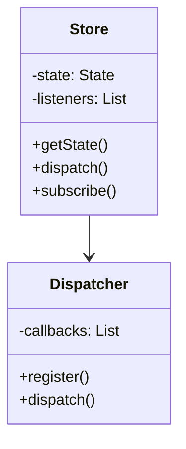
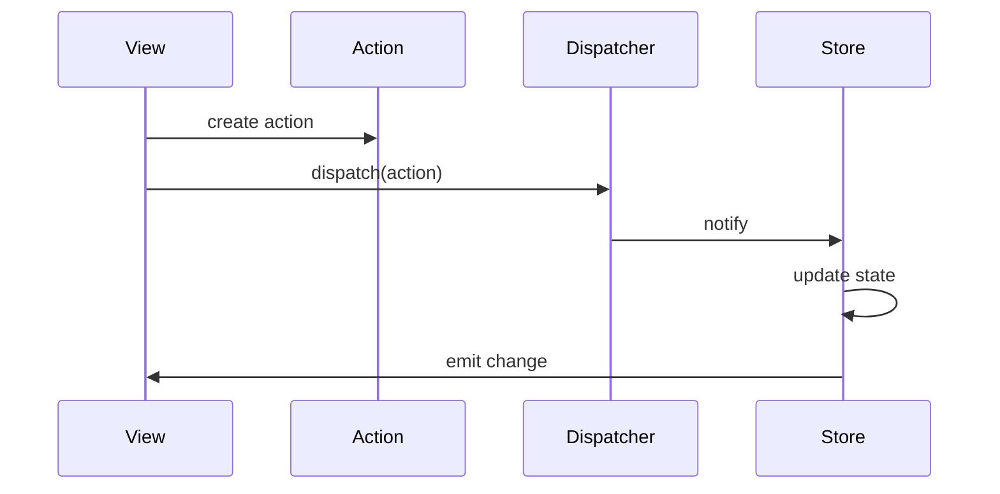

# Low-Level Design: [Pattern Name]

## Requirements & Scope

### Functional Requirements
1. [Requirement 1]
2. [Requirement 2]
3. [Requirement 3]

### Non-Functional Requirements
- [NFR 1: e.g., Thread-safety, Performance]
- [NFR 2: e.g., Extensibility, Maintainability]

## Gradle Build Configuration

[Include build.gradle.kts with dependencies]

## LLD Diagrams

### Class Diagram

### Sequence Diagram

## System Implementation

### Core Components

[Describe main components]

### Thread-Safety Strategy

[Explain concurrency approach]

## Code Examples

[Key implementation details]