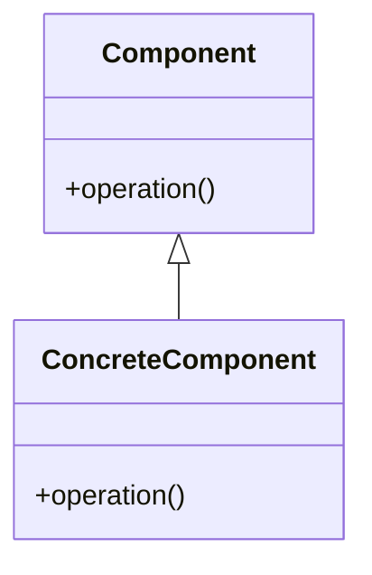

# Design Pattern: [Pattern Name]

**Category**: [Creational|Structural|Behavioral|Architectural]
**Difficulty**: [Beginner|Intermediate|Advanced]

## Intent

[Brief description of the pattern's purpose]

## Structure



## Implementation

### Key Classes

- **Component**: [Description]
- **ConcreteComponent**: [Description]

### Code Example

```java
// Component interface
public interface Component {
    void operation();
}

// Concrete implementation
public class ConcreteComponent implements Component {
    @Override
    public void operation() {
        // Implementation
    }
}
```

## When to Use

- [Scenario 1]
- [Scenario 2]

## Benefits

- [Benefit 1]
- [Benefit 2]