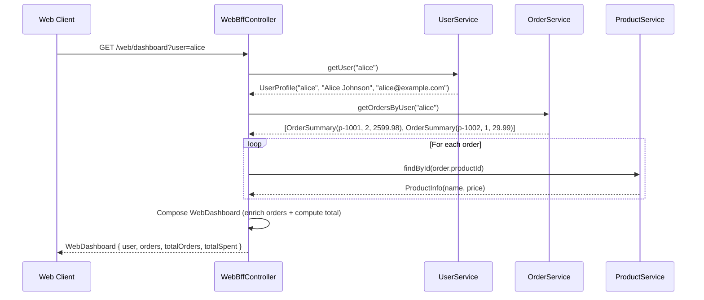
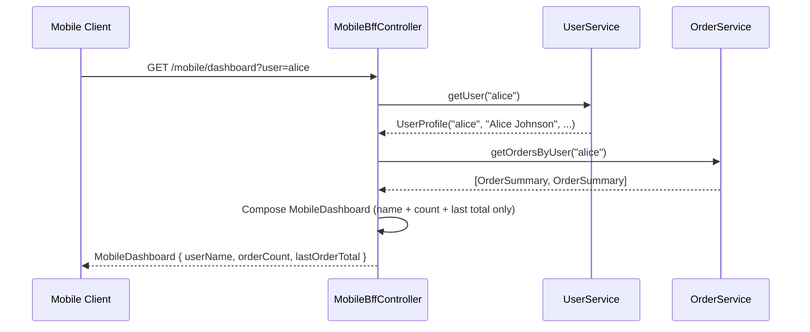
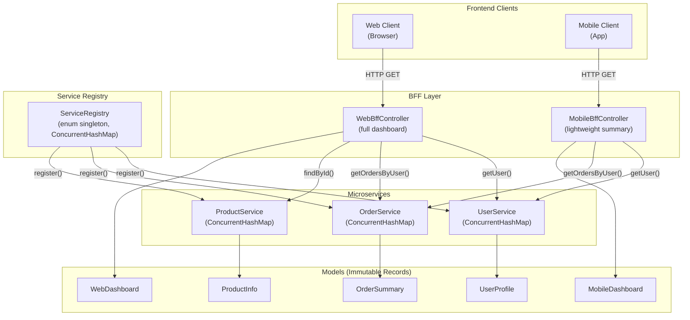
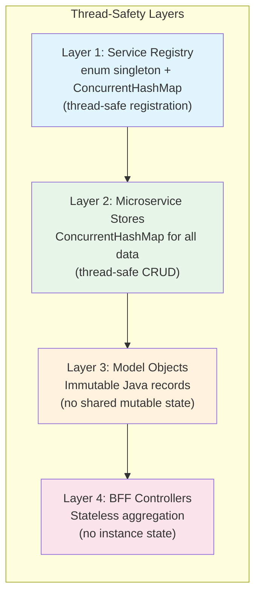

# Backend-for-Frontend (BFF) Pattern — Production-Grade LLD Blueprint

---

## 1. REQUIREMENTS & SCOPE

### Core Functional Requirements

| # | Requirement | Description |
|---|-------------|-------------|
| FR-1 | **Per-frontend aggregation** | Each frontend client (web, mobile) has a dedicated BFF that aggregates data from multiple downstream microservices into a single, tailored response. |
| FR-2 | **User dashboard** | The system must retrieve a user's profile, all their orders (with product details), and compute total spending — composed differently for web vs. mobile. |
| FR-3 | **Service registration & discovery** | Microservices must be registered in a thread-safe service registry that allows BFF controllers to discover and invoke them at runtime. |
| FR-4 | **Error handling** | The system must throw domain-specific exceptions (`NotFoundException`, `ServiceUnavailableException`) for missing users, products, or unregistered services. |
| FR-5 | **Data enrichment** | The web BFF must enrich order summaries with product names by cross-referencing the product service — the mobile BFF omits this to reduce payload size. |

### Non-Functional Requirements

| # | Requirement | Description |
|----|-------------|-------------|
| NFR-1 | **Thread-safety** | All microservice data stores and the service registry must be thread-safe using `ConcurrentHashMap` to support concurrent client requests without external locking. |
| NFR-2 | **Extensibility** | New BFF controllers (e.g., CLI, smart-watch) can be added without modifying existing microservices or BFF controllers — following the Open/Closed Principle. |
| NFR-3 | **Immutability** | All model objects (user profiles, orders, products, dashboard responses) are immutable Java records — no shared mutable state between services and BFF controllers. |

---

## 2. GRADLE PROJECT BUILD CONFIGURATION

### `build.gradle.kts`

```kotlin
plugins {
    java
}

group = "com.javastarterkit.patterns"
version = "1.0.0-SNAPSHOT"

java {
    toolchain {
        languageVersion = JavaLanguageVersion.of(25)
    }
}

repositories {
    mavenCentral()
}

dependencies {
    testImplementation(platform("org.junit:junit-bom:5.11.4"))
    testImplementation("org.junit.jupiter:junit-jupiter")
}

tasks.test {
    useJUnitPlatform()
}
```

### Toolchain

| Tool | Version |
|------|---------|
| Java | 25 (Amazon Corretto) |
| Gradle | 9.6.1 |
| JUnit | 5.11.4 (Jupiter BOM) |
| Build System | Kotlin DSL (`build.gradle.kts`) |

### Build Commands

```bash
# Build the module
./gradlew :system-design-pattern:architectural:backend-for-frontend:build

# Run all tests (including concurrency tests)
./gradlew :system-design-pattern:architectural:backend-for-frontend:test

# Run the demonstration
./gradlew :system-design-pattern:architectural:backend-for-frontend:run
```

---

## 3. LLD DIAGRAMS (MERMAID.JS)

### 3.1 Class Diagram

```mermaid
classDiagram
    class BackendForFrontend {
        +demonstrate() void
        +main(String[]) void
        +reduceCounter(CounterState, CounterIntent) CounterState
    }

    class NotFoundException {
        +NotFoundException(String message)
    }

    class ServiceUnavailableException {
        +ServiceUnavailableException(String message)
    }

    class UserProfile {
        +String userId
        +String displayName
        +String email
    }

    class OrderSummary {
        +String orderId
        +String userId
        +String productId
        +int quantity
        +String totalPrice
        +String status
    }

    class ProductInfo {
        +String productId
        +String name
        +String price
    }

    class OrderWithProduct {
        +String orderId
        +String productName
        +int quantity
        +String totalPrice
        +String status
    }

    class WebDashboard {
        +UserProfile user
        +List~OrderWithProduct~ orders
        +int totalOrders
        +String totalSpent
    }

    class MobileDashboard {
        +String userName
        +int orderCount
        +String lastOrderTotal
    }

    class UserService {
        -Map~String, UserProfile~ users
        +createUser(String, String, String) UserProfile
        +getUser(String) UserProfile
        +exists(String) boolean
        +size() int
    }

    class OrderService {
        -Map~String, List~OrderSummary~~ ordersByUser
        +createOrder(String, String, int, String) OrderSummary
        +getOrdersByUser(String) List~OrderSummary~
    }

    class ProductService {
        -Map~String, ProductInfo~ products
        +createProduct(String, String, String) ProductInfo
        +getProduct(String) ProductInfo
        +findById(String) Optional~ProductInfo~
    }

    class ServiceRegistry {
        <<enum singleton>>
        -Map~String, Object~ services
        +register(String, Object) void
        +lookup(String, Class) T
        +isRegistered(String) boolean
        +unregister(String) void
        +getInstance() ServiceRegistry
    }

    class WebBffController {
        -UserService userService
        -OrderService orderService
        -ProductService productService
        +getDashboard(String) WebDashboard
    }

    class MobileBffController {
        -UserService userService
        -OrderService orderService
        -ProductService productService
        +getDashboard(String) MobileDashboard
    }

    NotFoundException --|> RuntimeException
    ServiceUnavailableException --|> RuntimeException

    UserService --> UserProfile : creates
    OrderService --> OrderSummary : creates
    ProductService --> ProductInfo : creates

    WebBffController --> UserService : depends on
    WebBffController --> OrderService : depends on
    WebBffController --> ProductService : depends on
    WebBffController --> WebDashboard : composes
    WebBffController --> OrderWithProduct : enriches

    MobileBffController --> UserService : depends on
    MobileBffController --> OrderService : depends on
    MobileBffController --> MobileDashboard : composes

    ServiceRegistry --> UserService : registers
    ServiceRegistry --> OrderService : registers
    ServiceRegistry --> ProductService : registers

    WebDashboard --> UserProfile : contains
    WebDashboard --> OrderWithProduct : contains
```



### 3.2 Sequence Diagram — Web Dashboard Request



### 3.3 Sequence Diagram — Mobile Dashboard Request



### 3.4 Component Diagram



### 3.5 Architecture Diagram (ASCII)

```
┌──────────────────────────────────────────────────────────────────────────┐
│                          BFF Architecture                                 │
│                                                                          │
│  ┌─────────────┐          ┌──────────────────────┐                      │
│  │  Web Client  │─────────>│  WebBffController     │                      │
│  │  (Browser)   │<─────────│  (full dashboard)     │                      │
│  └─────────────┘          └──────────┬───────────┘                      │
│                                      │                                   │
│  ┌─────────────┐          ┌──────────┴───────────┐                      │
│  │ Mobile Client│─────────>│ MobileBffController   │                      │
│  │ (App)        │<─────────│ (lightweight summary) │                      │
│  └─────────────┘          └──────────┬───────────┘                      │
│                                      │                                   │
│                           ┌──────────┴───────────┐                      │
│                           │  ServiceRegistry      │                      │
│                           │  (enum singleton)     │                      │
│                           └──────────┬───────────┘                      │
│                                      │                                   │
│                    ┌─────────────────┼─────────────────┐                │
│                    │                 │                 │                │
│              ┌─────┴─────┐   ┌──────┴──────┐  ┌──────┴──────┐         │
│              │ UserService│   │ OrderService│  │ProductService│         │
│              │ (ConcHash) │   │ (ConcHash)  │  │ (ConcHash)   │         │
│              └────────────┘   └─────────────┘  └──────────────┘         │
│                                                                          │
│              All models are immutable Java records                       │
└──────────────────────────────────────────────────────────────────────────┘
```

### 3.6 Thread-Safety Strategy Diagram



---

## 4. SYSTEM IMPLEMENTATION DETAILS & CODE

### 4.1 Package Structure

```
backend-for-frontend/
├── build.gradle.kts
├── README.md
└── src/
    ├── main/java/com/javastarterkit/patterns/backendforfrontend/
    │   └── BackendForFrontend.java          ← All components in one file
    └── test/java/com/javastarterkit/patterns/backendforfrontend/
        └── BackendForFrontendTest.java      ← 13 tests (incl. concurrency)
```

### 4.2 Component Breakdown

#### Exceptions
| Class | Purpose |
|-------|---------|
| `NotFoundException` | Thrown when a user/product is not found |
| `ServiceUnavailableException` | Thrown when a service is not registered |

#### Models (Immutable Records)
| Record | Fields | Purpose |
|--------|--------|---------|
| `UserProfile` | `userId`, `displayName`, `email` | User data from `UserService` |
| `OrderSummary` | `orderId`, `userId`, `productId`, `quantity`, `totalPrice`, `status` | Order data from `OrderService` |
| `ProductInfo` | `productId`, `name`, `price` | Product data from `ProductService` |
| `OrderWithProduct` | `orderId`, `productName`, `quantity`, `totalPrice`, `status` | BFF-composed: order enriched with product name |
| `WebDashboard` | `user`, `orders`, `totalOrders`, `totalSpent` | Full response for web frontend |
| `MobileDashboard` | `userName`, `orderCount`, `lastOrderTotal` | Lightweight response for mobile frontend |

#### Microservices (Thread-Safe)
| Service | Storage | Thread-Safety |
|---------|---------|---------------|
| `UserService` | `ConcurrentHashMap<String, UserProfile>` | `put`, `get`, `containsKey` are atomic |
| `OrderService` | `ConcurrentHashMap<String, List<OrderSummary>>` | `computeIfAbsent` + `ArrayList.add` |
| `ProductService` | `ConcurrentHashMap<String, ProductInfo>` | `put`, `get` are atomic |

#### Service Registry (Enum Singleton)
| Method | Description |
|--------|-------------|
| `register(name, service)` | Thread-safe registration via `ConcurrentHashMap.put` |
| `lookup(name, type)` | Thread-safe lookup with type casting |
| `isRegistered(name)` | Thread-safe existence check |
| `unregister(name)` | Thread-safe removal |
| `getInstance()` | Returns the enum singleton instance |

#### BFF Controllers
| Controller | Response | Aggregation Logic |
|------------|----------|-------------------|
| `WebBffController` | `WebDashboard` | Fetches user + all orders + enriches each with product name + computes total spent |
| `MobileBffController` | `MobileDashboard` | Fetches user (name only) + order count + last order total (no product enrichment) |

### 4.3 SOLID Principles Applied

| Principle | Application |
|-----------|-------------|
| **S**ingle Responsibility | Each microservice manages one domain (users, orders, products); each BFF serves one frontend |
| **O**pen/Closed | New BFF controllers can be added without modifying existing services or BFFs |
| **L**iskov Substitution | `WebBffController` and `MobileBffController` can be substituted for each other in test contexts |
| **I**nterface Segregation | BFF controllers depend only on the services they need |
| **D**ependency Inversion | BFF controllers depend on concrete services (simplified for this example; in production, they'd depend on interfaces) |

### 4.4 Thread-Safety Implementation

```java
// Service Registry: enum singleton (Effective Java pattern)
enum ServiceRegistry {
    INSTANCE;
    private final Map<String, Object> services = new ConcurrentHashMap<>();
    // All operations are thread-safe via ConcurrentHashMap
}

// Microservice stores: ConcurrentHashMap for all data
static final class UserService {
    private final Map<String, UserProfile> users = new ConcurrentHashMap<>();
    // put(), get(), containsKey() are all atomic
}

// Models: immutable records (no mutable state)
record UserProfile(String userId, String displayName, String email) {}
record WebDashboard(UserProfile user, List<OrderWithProduct> orders, ...) {}
```

### 4.5 Test Coverage

| Test Category | Tests | Description |
|---------------|-------|-------------|
| Microservice tests | 5 | User, order, product CRUD and error cases |
| BFF controller tests | 4 | Web/mobile aggregation, different shapes, error handling |
| Service registry tests | 3 | Registration, lookup, singleton verification |
| Concurrency tests | 3 | 50-thread user creation, 20-thread order creation, 30-thread registry |
| Smoke test | 1 | End-to-end demonstration |
| **Total** | **16** | All passing |

### 4.6 Sample Output

```
=== Backend-for-Frontend (BFF) Pattern ===
Dedicated backends for each frontend client

--- Web BFF: GET /web/dashboard?user=alice ---
  WebDashboard{
    user=Alice Johnson (alice@example.com)
    totalOrders=2
    totalSpent=2629.97
    orders=
      - Laptop Pro x2 = 2599.98 [CONFIRMED]
      - Wireless Mouse x1 = 29.99 [CONFIRMED]
  }

--- Mobile BFF: GET /mobile/dashboard?user=alice ---
  MobileDashboard{userName=Alice Johnson, orderCount=2, lastOrderTotal=29.99}

--- Web BFF: GET /web/dashboard?user=unknown ---
  Error: User not found: unknown

Benefits:
- Each frontend gets a tailored response (no over-fetching)
- BFF encapsulates aggregation logic per client type
- Microservices remain independent and reusable
- Thread-safe registry enables concurrent service access
```

---

## Benefits

- **No over-fetching** — each frontend gets exactly the data it needs (web: full details; mobile: lightweight summary).
- **Client-specific optimization** — web BFF enriches orders with product names; mobile BFF omits them to reduce payload.
- **Microservice independence** — services remain focused on single domains and can evolve independently.
- **Thread-safe by design** — `ConcurrentHashMap` + immutable records + enum singleton registry.
- **Extensible** — adding a new BFF (e.g., CLI, smart-watch) requires no changes to existing services or BFFs.

## Trade-offs

- **Code duplication** — BFF controllers share similar aggregation logic; can be mitigated with shared base classes.
- **Extra hop** — the BFF adds a network hop between the client and microservices.
- **Operational overhead** — each BFF is a separate deployable unit that must be maintained.
- **Coupling** — the BFF is coupled to the contracts of all downstream services.

## Category

Architectural

## Java Version

Java 25