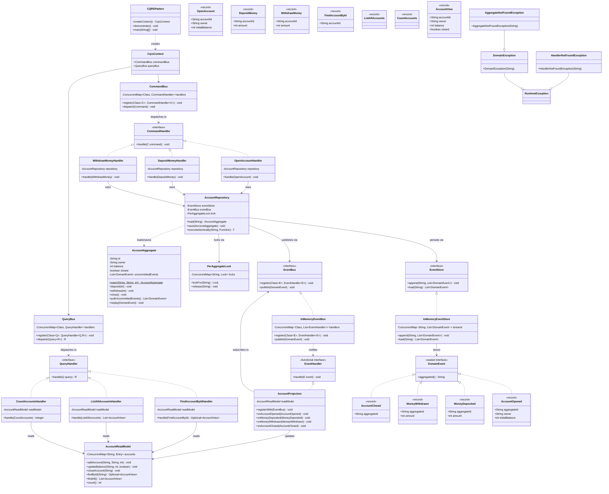
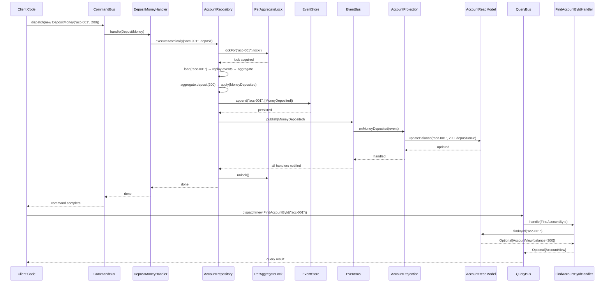

# Command Query Responsibility Segregation (CQRS) Pattern — Production-Grade LLD Blueprint

---

## 1. REQUIREMENTS & SCOPE

### Core Functional Requirements

| # | Requirement | Description |
|---|-------------|-------------|
| FR-1 | **Command-query separation** | The system must separate write operations (commands) from read operations (queries) into distinct, independent pipelines. |
| FR-2 | **Event-sourced write model** | The command side must persist domain events (not state) and reconstruct aggregate state by replaying events from an append-only event store. |
| FR-3 | **Denormalized read model** | The query side must maintain a denormalized, query-optimized read model synchronized from domain events via a projection. |
| FR-4 | **Business invariant enforcement** | The write-side aggregate must enforce domain rules (no negative balances, positive amounts only, sufficient funds for withdrawals, closed-account protection). |
| FR-5 | **Projection synchronization** | A projection bridge must subscribe to domain events and update the read model immediately after each command completes. |

### Non-Functional Requirements

| # | Requirement | Description |
|---|-------------|-------------|
| NFR-1 | **Thread-safety** | Concurrent commands to different aggregates must not block each other; concurrent commands to the same aggregate must be serialized to prevent invariant violations. |
| NFR-2 | **Immutability** | Commands, queries, events, and read-model DTOs are immutable Java records; no shared mutable state leaks across the command/query boundary. |
| NFR-3 | **Compile-time exhaustiveness** | Command and query hierarchies are sealed interfaces, enabling exhaustive pattern matching and preventing unhandled subtypes at compile time. |

---

## 2. GRADLE PROJECT BUILD CONFIGURATION

### `build.gradle.kts`

```kotlin
// ============================================================================
// Command Query Responsibility Segregation (CQRS) — Build Configuration
// ============================================================================
// Java 25 | Gradle 9.6.1 | JUnit 5.12 | AssertJ 3.27 | Lombok 1.18.38
// ============================================================================

plugins {
    `java`
    `application`
}

group = "com.javastarterkit.patterns"
version = "1.0.0-SNAPSHOT"

java {
    toolchain {
        languageVersion = JavaLanguageVersion.of(25)
        vendor = org.gradle.jvm.toolchain.JvmVendorSpec.AMAZON
    }
}

application {
    mainClass.set("com.javastarterkit.patterns.commandqueryresponsibilitysegregation.CQRSPattern")
}

repositories {
    mavenCentral()
}

dependencies {
    // ── Lombok: boilerplate reduction (constructor / getter generation) ──────
    compileOnly(libs.lombok)
    annotationProcessor(libs.lombok)

    testCompileOnly(libs.lombok)
    testAnnotationProcessor(libs.lombok)

    // ── Testing ─────────────────────────────────────────────────────────────
    testImplementation(platform(libs.junit.bom))
    testImplementation(libs.junit.jupiter)
    testImplementation(libs.assertj.core)
    testRuntimeOnly(libs.junit.platform.launcher)
}

// ── Compiler flags ───────────────────────────────────────────────────────────
tasks.withType<JavaCompile> {
    options.encoding = "UTF-8"
    options.compilerArgs.add("-Xlint:unchecked")
    options.compilerArgs.add("-Xlint:deprecation")
    options.compilerArgs.add("-Xlint:rawtypes")
    options.compilerArgs.add("-parameters")
}

tasks.test {
    useJUnitPlatform()
    testLogging {
        events("passed", "skipped", "failed")
        showStandardStreams = true
        showExceptions = true
        showCauses = true
        showStackTraces = true
    }
}
```

### Toolchain

| Tool | Version |
|------|---------|
| Java | 25 (Amazon Corretto) |
| Gradle | 9.6.1 |
| JUnit | 5.12.0 (Jupiter BOM) |
| AssertJ | 3.27.3 |
| Lombok | 1.18.38 |
| Build System | Kotlin DSL (`build.gradle.kts`) |

### Build Commands

```bash
# Build the module
./gradlew :system-design-pattern:architectural:command-query-responsibility-segregation:build

# Run all tests (including concurrency tests)
./gradlew :system-design-pattern:architectural:command-query-responsibility-segregation:test

# Run the demonstration
./gradlew :system-design-pattern:architectural:command-query-responsibility-segregation:run
```

---

## 3. LLD DIAGRAMS (MERMAID.JS)

### 3.1 Class Diagram



### 3.2 Sequence Diagram — End-to-End Command/Query Flow



### 3.3 Architecture Diagram (ASCII)

```
┌──────────────────────────────────────────────────────────────────────────┐
│                    CQRS Architecture (Bank Account Example)               │
│                                                                          │
│  ┌─────────────┐    ┌──────────────────────────────────────┐             │
│  │  Client Code │    │         Command Side (Write)          │             │
│  │             │    │  ┌────────────┐   ┌───────────────┐  │             │
│  │ dispatch()  │───>│  │ CommandBus │   │CommandHandler │  │             │
│  │             │    │  └─────┬──────┘   └──────┬────────┘  │             │
│  └─────────────┘    │        │                  │            │             │
│                     │  ┌─────┴────────┐         │            │             │
│  ┌─────────────┐    │  │AccountRepo  │         │            │             │
│  │  QueryBus   │    │  └──────┬──────┘         │            │             │
│  │ dispatch()  │<───│  dispatch │ load/mutate/save            │             │
│  │             │    │  └──────┬──────┘         │            │             │
│  └─────────────┘    │         │                │            │             │
│                     │  ┌──────┴──────┐   ┌─────┴────────┐  │             │
│                     │  │ EventStore   │   │PerAggregate   │  │             │
│                     │  │(append-only) │   │Lock (Reentrant)│             │
│                     │  └──────┬──────┘   └───────────────┘  │             │
│                     │         │                              │             │
│                     │  ┌──────┴──────┐                      │             │
│                     │  │  EventBus    │──>│ AccountProjection │             │
│                     │  │ (pub/sub)    │   │   (bridge)        │             │
│                     │  └─────────────┘   └────────┬──────────┘  │             │
│                     │                             │              │             │
│  ┌─────────────┐    │                    ┌────────┴──────────┐  │             │
│  │  QueryBus   │    │                    │   Query Side (Read)│  │             │
│  │ dispatch()  │<───│                    │ ┌───────────────┐ │  │             │
│  │             │    │                    │ │AccountReadModel│ │  │             │
│  └─────────────┘    │                    │ │(denormalized)  │ │  │             │
│                     │                    │ └───────────────┘ │  │             │
│                     │                    │                    │             │
│  ┌─────────────┐    │                    │ ┌───────────────┐ │  │             │
│  │ AccountView │<───│                    │ │ QueryHandler  │ │  │             │
│  │ (immutable) │    │                    │ │FindById/List/ │ │  │             │
│  └─────────────┘    │                    │ │     Count     │ │  │             │
│                     │                    │ └───────────────┘ │  │             │
│                     │                    └───────────────────┘  │             │
│                     └─────────────────────────────────────────────┘             │
│                                                                          │
│  Event flow:  Command → Handler → Aggregate → EventStore → EventBus →      │
│               Projection → ReadModel → Query → Handler → AccountView       │
└──────────────────────────────────────────────────────────────────────────┘
```

---

## 4. SYSTEM IMPLEMENTATION DETAILS & CODE

### 4.1 Package Structure

```
command-query-responsibility-segregation/
├── build.gradle.kts
├── README.md
└── src/
    ├── main/java/com/javastarterkit/patterns/commandqueryresponsibilitysegregation/
    │   ├── CQRSPattern.java                          ← Composition root + demonstrate()
    │   ├── domain/
    │   │   ├── event/
    │   │   │   ├── DomainEvent.java                   ← Sealed interface
    │   │   │   ├── AccountOpened.java                 ← Record
    │   │   │   ├── MoneyDeposited.java                ← Record
    │   │   │   ├── MoneyWithdrawn.java                ← Record
    │   │   │   └── AccountClosed.java                 ← Record
    │   │   └── model/
    │   │       └── AccountAggregate.java              ← Event-sourced aggregate root
    │   ├── application/
    │   │   ├── command/
    │   │   │   ├── Command.java                       ← Sealed interface
    │   │   │   ├── OpenAccount.java                   ← Record
    │   │   │   ├── DepositMoney.java                  ← Record
    │   │   │   ├── WithdrawMoney.java                 ← Record
    │   │   │   ├── CommandHandler.java                ← Generic handler contract
    │   │   │   ├── CommandBus.java                    ← Thread-safe mediator
    │   │   │   ├── OpenAccountHandler.java
    │   │   │   ├── DepositMoneyHandler.java
    │   │   │   └── WithdrawMoneyHandler.java
    │   │   ├── query/
    │   │   │   ├── Query.java                         ← Sealed interface<R>
    │   │   │   ├── FindAccountById.java               ← Record
    │   │   │   ├── ListAllAccounts.java               ← Record
    │   │   │   ├── CountAccounts.java                 ← Record
    │   │   │   ├── QueryHandler.java                  ← Generic handler contract
    │   │   │   ├── QueryBus.java                      ← Thread-safe mediator
    │   │   │   ├── FindAccountByIdHandler.java
    │   │   │   ├── ListAllAccountsHandler.java
    │   │   │   └── CountAccountsHandler.java
    │   │   └── projection/
    │   │       ├── EventHandler.java                  ← Functional interface
    │   │       └── AccountProjection.java             ← Event → read-model bridge
    │   └── infrastructure/
    │       ├── EventBus.java                          ← Interface
    │       ├── InMemoryEventBus.java                  ← CopyOnWriteArrayList impl
    │       ├── EventStore.java                        ← Interface
    │       ├── InMemoryEventStore.java                ← ConcurrentHashMap impl
    │       ├── AccountRepository.java                 ← Repository + locking
    │       ├── AccountReadModel.java                  ← Thread-safe read store
    │       ├── AccountView.java                       ← Immutable read DTO
    │       └── PerAggregateLock.java                  ← ReentrantLock per aggregate
    └── test/java/com/javastarterkit/patterns/commandqueryresponsibilitysegregation/
        └── CQRSPatternTest.java                       ← 20 tests, 6 nested groups
```

### 4.2 Component Breakdown

#### Domain Layer (Write Model)

| Class / Record | Purpose |
|----------------|---------|
| `AccountAggregate` | Event-sourced aggregate root; enforces business invariants; emits domain events |
| `DomainEvent` | Sealed base interface for all events; exposes `aggregateId()` |
| `AccountOpened` | Record emitted when a new account is created |
| `MoneyDeposited` | Record emitted when money is deposited |
| `MoneyWithdrawn` | Record emitted when money is withdrawn |
| `AccountClosed` | Record emitted when an account is closed |

**Business Invariants enforced by `AccountAggregate`:**
- Initial balance cannot be negative
- Deposit amount must be strictly positive
- Withdrawal amount must be strictly positive and must not exceed balance
- No operations permitted on a closed account (except `close()`, which is idempotent-safe)

#### Application Layer — Command Side

| Class | Responsibility |
|-------|----------------|
| `Command` | Sealed base interface for all commands (`OpenAccount`, `DepositMoney`, `WithdrawMoney`) |
| `OpenAccount` | Record carrying `accountId`, `owner`, `initialBalance` |
| `DepositMoney` | Record carrying `accountId`, `amount` |
| `WithdrawMoney` | Record carrying `accountId`, `amount` |
| `CommandHandler<C>` | Generic handler contract: `void handle(C command)` |
| `CommandBus` | Thread-safe mediator routing commands to registered handlers via `ConcurrentHashMap` |
| `OpenAccountHandler` | Creates aggregate via `AccountAggregate.open()` and persists events |
| `DepositMoneyHandler` | Delegates to `repository.executeAtomically()` → `aggregate.deposit()` |
| `WithdrawMoneyHandler` | Delegates to `repository.executeAtomically()` → `aggregate.withdraw()` |

#### Application Layer — Query Side

| Class | Responsibility |
|-------|----------------|
| `Query<R>` | Sealed base interface parameterized by result type |
| `FindAccountById` | Query record returning `Optional<AccountView>` |
| `ListAllAccounts` | Query record returning `List<AccountView>` |
| `CountAccounts` | Query record returning `Integer` |
| `QueryHandler<Q, R>` | Generic handler contract: `R handle(Q query)` |
| `QueryBus` | Thread-safe mediator routing queries and returning typed results |
| `FindAccountByIdHandler` | Reads `AccountView` by ID from read model |
| `ListAllAccountsHandler` | Returns snapshot list of all accounts |
| `CountAccountsHandler` | Returns total account count |

#### Application Layer — Projection

| Class | Responsibility |
|-------|----------------|
| `EventHandler<E>` | `@FunctionalInterface` for event-specific callbacks |
| `AccountProjection` | Subscribes to 4 event types; updates `AccountReadModel` in response |

#### Infrastructure Layer

| Class | Responsibility | Thread-Safety Mechanism |
|-------|----------------|------------------------|
| `EventBus` | Pub/sub interface connecting write side to read side | — |
| `InMemoryEventBus` | Synchronous in-process event bus | `ConcurrentHashMap` + `CopyOnWriteArrayList` |
| `EventStore` | Append-only event stream per aggregate | — |
| `InMemoryEventStore` | In-memory event store | `ConcurrentHashMap` + atomic `compute()` |
| `AccountRepository` | Loads/saves aggregates; orchestrates event store, event bus, and lock | Delegates to `PerAggregateLock` |
| `AccountReadModel` | Denormalized query-optimized read store | `ConcurrentHashMap` + `computeIfPresent` |
| `AccountView` | Immutable DTO: `accountId`, `owner`, `balance`, `closed` | Java record (immutable) |
| `PerAggregateLock` | Per-aggregate `ReentrantLock` registry | `ConcurrentHashMap` + `computeIfAbsent` |

#### Exceptions

| Class | Purpose |
|-------|---------|
| `DomainException` | Unchecked; thrown when business invariants are violated |
| `AggregateNotFoundException` | Unchecked; thrown when an aggregate has no event stream |
| `HandlerNotFoundException` | Unchecked; thrown when no handler is registered for a command/query |

### 4.3 SOLID Principles Applied

| Principle | Application |
|-----------|-------------|
| **S**ingle Responsibility | `AccountAggregate` enforces invariants and emits events; `AccountRepository` handles persistence; `AccountProjection` synchronizes the read model; each handler handles exactly one command/query type |
| **O**pen/Closed | New commands, queries, or event types can be added by extending the sealed hierarchies and registering new handlers — no existing code is modified |
| **L**iskov Substitution | Any `CommandHandler<C>` implementation can be substituted; any `EventHandler<E>` can be registered on the event bus |
| **I**nterface Segregation | `Command`, `Query<R>`, `EventHandler<E>` are minimal, focused interfaces; clients depend only on what they use |
| **D**ependency Inversion | Handlers depend on abstractions (`CommandHandler`, `QueryHandler`); the repository depends on `EventStore` and `EventBus` interfaces, not concrete implementations |

### 4.4 Thread-Safety Strategy

```java
// 1. Per-aggregate pessimistic locking
//    - AccountRepository.executeAtomically() acquires a ReentrantLock per aggregate ID
//    - Concurrent commands to DIFFERENT aggregates never block
//    - Concurrent commands to the SAME aggregate are fully serialized

// 2. Event store atomicity
//    - InMemoryEventStore.append() uses ConcurrentHashMap.compute()
//    - Combined with PerAggregateLock, provides double protection

// 3. Event bus lock-free iteration
//    - InMemoryEventBus uses CopyOnWriteArrayList for subscriber lists
//    - publish() iterates without acquiring external locks

// 4. Read model concurrent reads/writes
//    - AccountReadModel uses ConcurrentHashMap
//    - Mutations via computeIfPresent / put (atomic per key)
//    - Reads return defensive copies / snapshots
```

### 4.5 Sealed-Type Exhaustiveness

```java
// Command hierarchy — compile-time exhaustiveness guaranteed
public sealed interface Command
        permits OpenAccount, DepositMoney, WithdrawMoney { ... }

// Query hierarchy — compile-time exhaustiveness guaranteed
public sealed interface Query<R>
        permits FindAccountById, ListAllAccounts, CountAccounts { ... }

// DomainEvent hierarchy — switch expression is exhaustive
public sealed interface DomainEvent
        permits AccountOpened, MoneyDeposited, MoneyWithdrawn, AccountClosed { ... }
```

### 4.6 Event Sourcing Flow

```java
// Write path (command handling):
// 1. CommandBus dispatches to CommandHandler
// 2. CommandHandler calls AccountRepository.executeAtomically()
// 3. Repository acquires per-aggregate lock
// 4. Repository loads aggregate by replaying events from EventStore
// 5. Aggregate business method emits new DomainEvent via apply()
// 6. Repository pulls uncommitted events and appends to EventStore
// 7. Repository publishes each event to EventBus
// 8. AccountProjection receives event and updates AccountReadModel
// 9. Repository releases lock

// Rebuild path (aggregate reconstruction):
// 1. Repository loads all events for aggregate ID from EventStore
// 2. Creates new AccountAggregate shell
// 3. Calls aggregate.replay(event) for each event in order
// 4. Aggregate state is fully reconstructed without any persisted snapshot
```

### 4.7 Test Coverage

| Test Category | Tests | Description |
|---------------|-------|-------------|
| End-to-end flow | 2 | Full command→event→projection→query flow; `demonstrate()` smoke test |
| Business invariants | 5 | Negative balance, non-positive deposit, insufficient funds, non-existent account, post-withdrawal balance |
| Event sourcing & replay | 3 | Aggregate reconstruction from events, event store retention, read model rebuild |
| Projection sync | 5 | AccountOpened creates entry, MoneyDeposited increases balance, MoneyWithdrawn decreases balance, empty findById, list all |
| Error handling | 2 | Unregistered command/query throws `HandlerNotFoundException` |
| Concurrency | 3 | Concurrent deposits to different aggregates, concurrent withdrawals respecting invariants, high-throughput mixed ops |
| **Total** | **20** | All passing under Java 25 |

### 4.8 Sample Output

```
=== Command Query Responsibility Segregation (CQRS) Pattern ===
Separates write (command) and read (query) models for independent
scaling and optimization

--- COMMAND SIDE (writes) ---
  [CMD] OpenAccount owner=Alice initialBalance=100
  [CMD] OpenAccount owner=Bob initialBalance=50
  [CMD] DepositMoney id=acc-001 amount=200
  [CMD] WithdrawMoney id=acc-002 amount=20
  [CMD] DepositMoney id=acc-002 amount=70

--- QUERY SIDE (reads) ---
  Find Alice by id: Optional[AccountView{id=acc-001, owner=Alice, balance=300, closed=false}]
  Find Bob by id:   Optional[AccountView{id=acc-002, owner=Bob, balance=100, closed=false}]
  All accounts:     [AccountView{id=acc-001, owner=Alice, balance=300, closed=false}, AccountView{id=acc-002, owner=Bob, balance=100, closed=false}]
  Account count:    2

Benefits:
  - Write model is optimized for business rules & validation
  - Read model is optimized for queries (denormalized, fast lookups)
  - Read and write sides can scale independently
  - Read model can be rebuilt from the event stream at any time
  - Thread-safe: per-aggregate locks serialize concurrent commands
```

---

## Benefits

- **Independent optimization** — the write model is optimized for business rules and event sourcing; the read model is optimized for fast, denormalized queries.
- **Independent scaling** — read and write sides can scale separately to match their load profiles.
- **Rebuildable read models** — the read model can always be rebuilt by replaying the event stream.
- **Clear separation of concerns** — commands and queries have distinct, focused interfaces and handlers.
- **Thread-safe by design** — per-aggregate `ReentrantLock` serializes concurrent commands to the same aggregate; `ConcurrentHashMap` and `CopyOnWriteArrayList` provide lock-free reads and safe iteration.
- **Compile-time safety** — sealed interfaces guarantee exhaustive pattern matching for commands, queries, and domain events.

## Trade-offs

- **Increased complexity** — two models, an event store, and synchronization infrastructure must be maintained.
- **Eventual consistency** — in distributed deployments with async message brokers, the read model may lag the write model (this synchronous example provides immediate consistency).
- **Operational overhead** — the event store must be backed up, and projections must handle replay on failure.
- **Learning curve** — teams must understand event-driven synchronization, projections, and event sourcing.

## Category

Architectural

## Java Version

Java 25