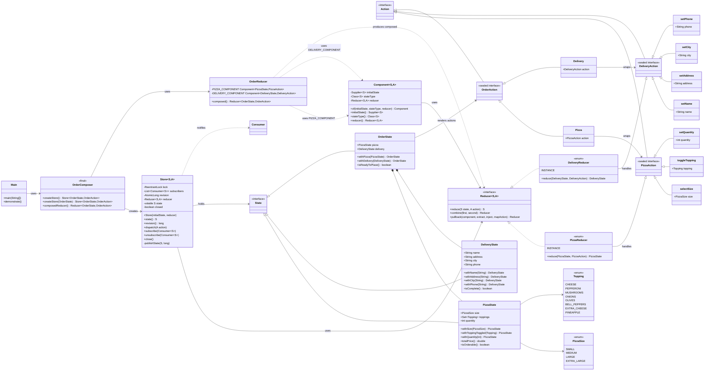
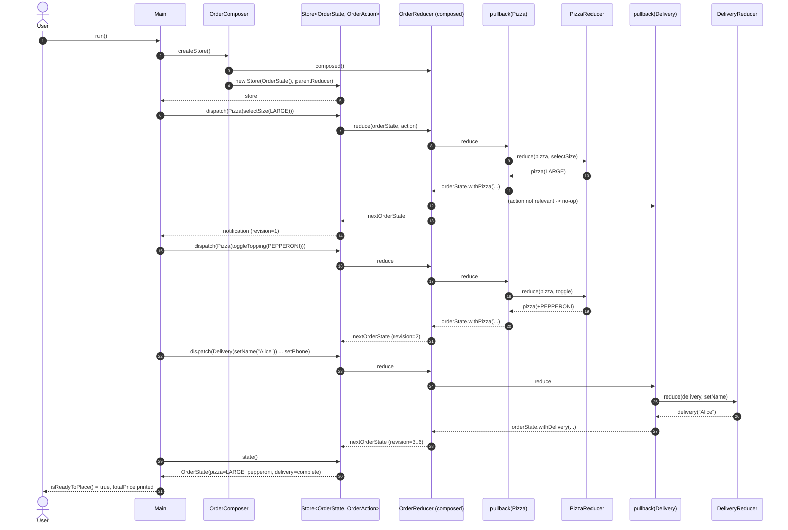

# Composable Architecture — Low-Level Design (LLD)

## 1. REQUIREMENTS & SCOPE

### 1.1 Functional Requirements

| ID | Requirement |
|----|-------------|
| FR-1 | The system MUST allow building a **pizza** configuration feature that owns its own `State` (size, toppings, quantity) and `Reducer` independently of other features. |
| FR-2 | The system MUST allow building a **delivery details** feature that owns its own `State` (name, address, city, phone) and `Reducer` independently of the pizza feature. |
| FR-3 | The system MUST **compose** the independent pizza and delivery features into a single root `OrderState` / `OrderAction` without coupling them to each other, using pullback + combine. |
| FR-4 | The system MUST route parent actions to the correct child reducer and **preserve isolation** of unrelated state slices across dispatches. |
| FR-5 | The system MUST expose a thread-safe `Store` that dispatches actions, notifies subscribers on state transitions, and reports a monotonic revision counter. |

### 1.2 Non-Functional Requirements

| ID | Requirement |
|----|-------------|
| NFR-1 | **Concurrency & thread-safety**: A single `Store` may be driven concurrently by multiple producer threads; no updates may be lost, and readers must always observe a consistent, internally-coherent immutable snapshot. |
| NFR-2 | **Extensibility / composability**: New features must be addable by authoring a self-contained `Component` and wiring it into the parent via `pullback`, without modifying existing feature reducers. |
| NFR-3 | **Determinism & purity**: Reducers are pure functions `(State, Action) -> State` — no side effects, no I/O, trivially unit-testable and safe to share across threads and stores. |
| NFR-4 | **Performance**: Lock hold-times in `dispatch` are minimal (pure, fast reducers); subscriber lists use copy-on-write for lock-free reads. |

---

## 2. GRADLE PROJECT BUILD CONFIGURATION

**Toolchain** (from `.sdkmanrc`): `java=25.0.4-amzn`, `gradle=9.6.1`, `kotlin=2.4.10`.

**`build.gradle.kts`** — uses the centralized version catalog (`gradle/libs.versions.toml`) with type-safe accessors:

```kotlin
// ============================================================================
// Composable Architecture Pattern - Build Configuration
// ============================================================================
// Uses the centralized version catalog (gradle/libs.versions.toml) for all
// dependency versions. Java 25 toolchain as defined in .sdkmanrc.
// ============================================================================

plugins {
    `java-library`
}

group = "com.javastarterkit.patterns"
version = "1.0.0-SNAPSHOT"

// Access the version catalog programmatically — the `libs` accessor is
// not always generated for the root build script of an included build.
val libs = rootProject.extensions
    .getByType<org.gradle.api.artifacts.VersionCatalogsExtension>()
    .named("libs")

java {
    sourceCompatibility = JavaVersion.toVersion(libs.findVersion("java-language").get().displayName)
    targetCompatibility = JavaVersion.toVersion(libs.findVersion("java-language").get().displayName)
}

dependencies {
    // SLF4J API for logging abstraction
    implementation(libs.findLibrary("slf4j-api").get())

    // Logback for concrete logging implementation
    runtimeOnly(libs.findLibrary("logback-classic").get())

    // Testing
    testImplementation(libs.findLibrary("junit.bom").get())
    testImplementation(libs.findLibrary("junit.jupiter").get())
    testImplementation(libs.findLibrary("assertj.core").get())
    testImplementation(libs.findLibrary("mockito.core").get())
    testImplementation(libs.findLibrary("mockito.junit.jupiter").get())
    testRuntimeOnly(libs.findLibrary("junit.platform.launcher").get())
}

tasks.withType<JavaCompile> {
    options.encoding = "UTF-8"
    options.compilerArgs.add("-Xlint:unchecked")
    options.compilerArgs.add("-Xlint:deprecation")
    options.compilerArgs.add("-parameters")
}

tasks.withType<Test> {
    useJUnitPlatform()
    testLogging {
        events("passed", "skipped", "failed")
        showStandardStreams = true
        showExceptions = true
        showCauses = true
        showStackTraces = true
    }
    // Java 25+ JVM compatibility settings
    jvmArgs(
        "-XX:+EnableDynamicAgentLoading",
        "-Xshare:off"
    )
}
```

---

## 3. LLD DIAGRAMS (MERMAID.JS)

### 3.1 Class Diagram



### 3.2 Sequence Diagram — End-to-End Order Placement



---

## 4. SYSTEM IMPLEMENTATION DETAILS & CODE

### 4.1 Package Structure

```
composable-architecture/
├── build.gradle.kts
├── README.md
├── LLD.md
└── src/
    ├── main/java/com/javastarterkit/patterns/composablearchitecture/
    │   ├── Main.java                                  # Application entry point
    │   ├── core/
    │   │   ├── State.java                             # Marker interface
    │   │   ├── Action.java                            # Marker interface
    │   │   ├── Reducer.java                           # Pure function + combine/pullback
    │   │   ├── component/Component.java               # Feature bundle (state+reducer)
    │   │   └── store/Store.java                       # Thread-safe runtime engine
    │   ├── exception/
    │   │   ├── ComposableArchitectureException.java   # Base runtime exception
    │   │   ├── InvalidPizzaException.java             # Pizza validation error
    │   │   └── InvalidDeliveryException.java          # Delivery validation error
    │   ├── ui/
    │   │   ├── models/
    │   │   │   ├── PizzaSize.java                     # Enum of pizza sizes
    │   │   │   ├── Topping.java                       # Enum of toppings
    │   │   │   ├── PizzaState.java                    # Immutable pizza state
    │   │   │   ├── DeliveryState.java                 # Immutable delivery state
    │   │   │   └── OrderState.java                    # Composed root state
    │   │   ├── actions/
    │   │   │   ├── PizzaAction.java                   # Sealed pizza actions
    │   │   │   ├── DeliveryAction.java                # Sealed delivery actions
    │   │   │   └── OrderAction.java                   # Sealed parent action wrapper
    │   │   └── reducers/
    │   │       ├── PizzaReducer.java                  # Pizza feature reducer (enum)
    │   │       ├── DeliveryReducer.java               # Delivery feature reducer (enum)
    │   │       └── OrderReducer.java                  # Composed parent reducer
    │   └── composition/
    │       └── OrderComposer.java                     # Store factory / wiring
    └── test/java/com/javastarterkit/patterns/composablearchitecture/
        ├── PizzaReducerTest.java
        ├── DeliveryReducerTest.java
        ├── OrderCompositionTest.java
        └── StoreConcurrencyTest.java
```

### 4.2 Concurrency / Thread-Safety Strategy

| Construct | Purpose |
|-----------|---------|
| **Immutable `State` records** (copy-on-write) | Every state is a value object; no in-place mutation. Any thread can read a snapshot at any time without locks. |
| **`ReentrantLock`** in `Store` | Serializes the read-modify-write cycle of `dispatch`. Pure, fast reducers keep hold-times tiny; reentrancy prevents deadlock on nested/recursive dispatch. |
| **`CopyOnWriteArrayList`** for subscribers | Copy-on-write guarantees lock-free iteration while notifying subscribers. |
| **`AtomicLong`** revision counter | Monotonic change counter for change-detection and caching. |
| **Enum singletons** for reducers (`INSTANCE`) | Idiomatic, thread-safe singletons; stateless so safe to share across threads and stores. |
| **`volatile` state reference** | Safe publication of the latest immutable snapshot to concurrent readers. |

### 4.3 End-to-End Execution (Main)

```java
Store<OrderState, OrderAction> store = OrderComposer.createStore();
store.subscribe(state -> log.info("revision={} {}", store.revision(), state));

store.dispatch(new OrderAction.Pizza(new PizzaAction.selectSize(PizzaSize.LARGE)));
store.dispatch(new OrderAction.Pizza(new PizzaAction.toggleTopping(Topping.PEPPERONI)));
store.dispatch(new OrderAction.Pizza(new PizzaAction.setQuantity(2)));

store.dispatch(new OrderAction.Delivery(new DeliveryAction.setName("Alice")));
// ... setAddress / setCity / setPhone

OrderState finalState = store.state();   // ready = pizza.isOrderable() && delivery.isComplete()
double total = finalState.pizza().totalPrice();
```

### 4.4 Build & Test Commands

```bash
# Build the pattern module
./gradlew :system-design-pattern:architectural:composable-architecture:build

# Run the tests
./gradlew :system-design-pattern:architectural:composable-architecture:test

# Run the Main demonstration
./gradlew :system-design-pattern:architectural:composable-architecture:run