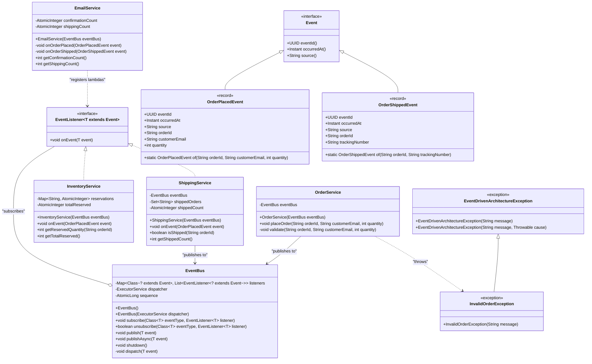
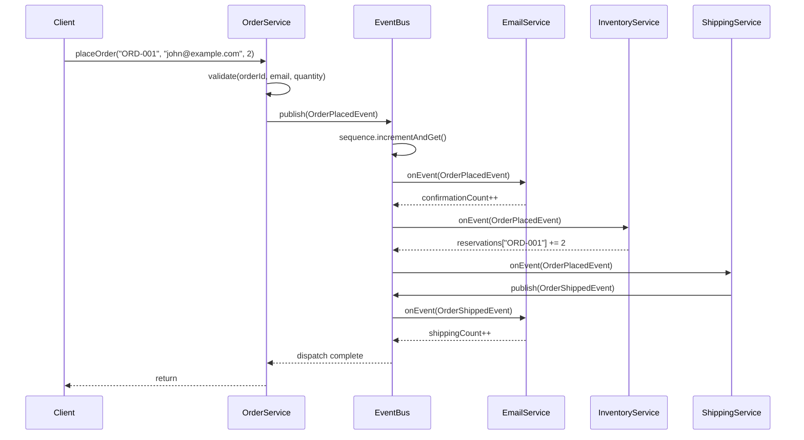

# Event-Driven Architecture — Low-Level Design (LLD)

## 1. REQUIREMENTS & SCOPE

### 1.1 Functional Requirements

| # | Requirement |
|---|---|
| FR-1 | **Publish-Subscribe Event Bus** — Provide a thread-safe in-memory event bus supporting typed event subscription, publication, and unsubscription. |
| FR-2 | **Order Placement Flow** — `OrderService` publishes an `OrderPlacedEvent` when a customer places an order. |
| FR-3 | **Reactive Subscribers** — `EmailService`, `InventoryService`, and `ShippingService` react to `OrderPlacedEvent` independently and decoupled from the publisher. |
| FR-4 | **Chained Event Propagation** — `ShippingService` publishes an `OrderShippedEvent` after shipping, which `EmailService` consumes to send a shipping notification. |
| FR-5 | **Fault Isolation** — A failing listener must not prevent other listeners from processing the same event. |

### 1.2 Non-Functional Requirements

| # | Requirement |
|---|---|
| NFR-1 | **Thread-Safety** — Concurrent publishers and subscribers must operate safely without data races or lost updates. |
| NFR-2 | **Extensibility** — New event types and subscribers must be addable without modifying existing components (Open/Closed Principle). |
| NFR-3 | **Observability** — Structured logging via SLF4J for event publication, subscription, and listener failures. |

---

## 2. GRADLE PROJECT BUILD CONFIGURATION

**File**: `build.gradle.kts`

```kotlin
// ============================================================================
// Event-Driven Architecture Pattern - Build Configuration
// ============================================================================
// Uses the centralized version catalog (gradle/libs.versions.toml) for all
// dependency versions. Java 25 toolchain as defined in .sdkmanrc.
// ============================================================================

plugins {
    `java-library`
    application
}

group = "com.javastarterkit.patterns"
version = "1.0.0-SNAPSHOT"

// Access the version catalog programmatically — the `libs` accessor is
// not always generated for the root build script of an included build.
val libs = rootProject.extensions
    .getByType<org.gradle.api.artifacts.VersionCatalogsExtension>()
    .named("libs")

java {
    sourceCompatibility = JavaVersion.toVersion(libs.findVersion("java-language").get().displayName)
    targetCompatibility = JavaVersion.toVersion(libs.findVersion("java-language").get().displayName)
}

dependencies {
    // SLF4J API for logging abstraction
    implementation(libs.findLibrary("slf4j-api").get())

    // Logback for concrete logging implementation
    runtimeOnly(libs.findLibrary("logback-classic").get())

    // Testing - JUnit BOM as platform, then specific modules
    testImplementation(platform(libs.findLibrary("junit.bom").get()))
    testImplementation(libs.findLibrary("junit.jupiter").get())
    testImplementation(libs.findLibrary("assertj.core").get())
    testImplementation(libs.findLibrary("mockito.core").get())
    testImplementation(libs.findLibrary("mockito.junit.jupiter").get())
    testRuntimeOnly(libs.findLibrary("junit.platform.launcher").get())
}

application {
    mainClass.set("com.javastarterkit.patterns.eventdrivenarchitecture.Main")
}

tasks.withType<JavaCompile> {
    options.encoding = "UTF-8"
    options.compilerArgs.add("-Xlint:unchecked")
    options.compilerArgs.add("-Xlint:deprecation")
    options.compilerArgs.add("-parameters")
}

tasks.withType<Test> {
    useJUnitPlatform()
    testLogging {
        events("passed", "skipped", "failed")
        showStandardStreams = true
        showExceptions = true
        showCauses = true
        showStackTraces = true
    }
    // Java 25+ JVM compatibility settings
    jvmArgs(
        "-XX:+EnableDynamicAgentLoading",
        "-Xshare:off"
    )
}
```

---

## 3. LLD DIAGRAMS (MERMAID.JS)

### 3.1 Class Diagram



### 3.2 Sequence Diagram — Order Placement End-to-End Flow



---

## 4. SYSTEM IMPLEMENTATION DETAILS & CODE

### 4.1 Package Structure

```
com.javastarterkit.patterns.eventdrivenarchitecture
├── core/
│   ├── Event.java              (interface)
│   ├── EventListener.java      (functional interface)
│   └── EventBus.java           (thread-safe pub-sub bus)
├── events/
│   ├── OrderPlacedEvent.java   (record)
│   └── OrderShippedEvent.java  (record)
├── service/
│   ├── OrderService.java       (publisher)
│   ├── EmailService.java       (subscriber)
│   ├── InventoryService.java   (subscriber)
│   └── ShippingService.java    (subscriber + publisher)
├── exception/
│   ├── EventDrivenArchitectureException.java
│   └── InvalidOrderException.java
└── Main.java                   (entry point)
```

### 4.2 Concurrency / Thread-Safety Strategy

| Construct | Where Used | Purpose |
|---|---|---|
| `ConcurrentHashMap` | `EventBus.listeners` | Thread-safe listener registry keyed by event type |
| `CopyOnWriteArrayList` | `EventBus` listener lists | Thread-safe iteration during publication |
| `AtomicLong` | `EventBus.sequence` | Monotonic event sequence numbers |
| `Executors.newVirtualThreadPerTaskExecutor()` | `EventBus.dispatcher` | Asynchronous dispatch with virtual threads |
| `AtomicInteger` | `EmailService`, `InventoryService`, `ShippingService` | Thread-safe counters |
| `ConcurrentHashMap` + `AtomicInteger` | `InventoryService.reservations` | Per-order reservation tracking |
| `ConcurrentHashMap.newKeySet()` | `ShippingService.shippedOrders` | Thread-safe shipped-order set |

### 4.3 Key Implementation Files

All source files are located under:
`src/main/java/com/javastarterkit/patterns/eventdrivenarchitecture/`

| File | Responsibility |
|---|---|
| `core/Event.java` | Base event interface with `eventId()`, `occurredAt()`, `source()` |
| `core/EventListener.java` | `@FunctionalInterface` for event subscribers |
| `core/EventBus.java` | Thread-safe pub-sub bus with sync + async dispatch |
| `events/OrderPlacedEvent.java` | Immutable record for order placement |
| `events/OrderShippedEvent.java` | Immutable record for order shipping |
| `service/OrderService.java` | Publisher — validates and emits `OrderPlacedEvent` |
| `service/EmailService.java` | Subscriber — sends confirmation + shipping emails |
| `service/InventoryService.java` | Subscriber — reserves inventory per order |
| `service/ShippingService.java` | Subscriber + Publisher — ships orders, emits `OrderShippedEvent` |
| `exception/EventDrivenArchitectureException.java` | Base exception |
| `exception/InvalidOrderException.java` | Domain exception for invalid orders |
| `Main.java` | Entry point demonstrating end-to-end flow |

### 4.4 Tests

| Test Class | Coverage |
|---|---|
| `EventBusTest.java` | End-to-end flow, multiple orders, invalid input, unsubscribe, fault isolation |
| `EventBusConcurrencyTest.java` | 16 threads × 100 orders = 1,600 concurrent events, all counters verified |

### 4.5 Run Commands

```bash
# Run the application
./gradlew :design-patterns:system-design-pattern:architectural:event-driven-architecture:run

# Run tests
./gradlew :design-patterns:system-design-pattern:architectural:event-driven-architecture:test
```
