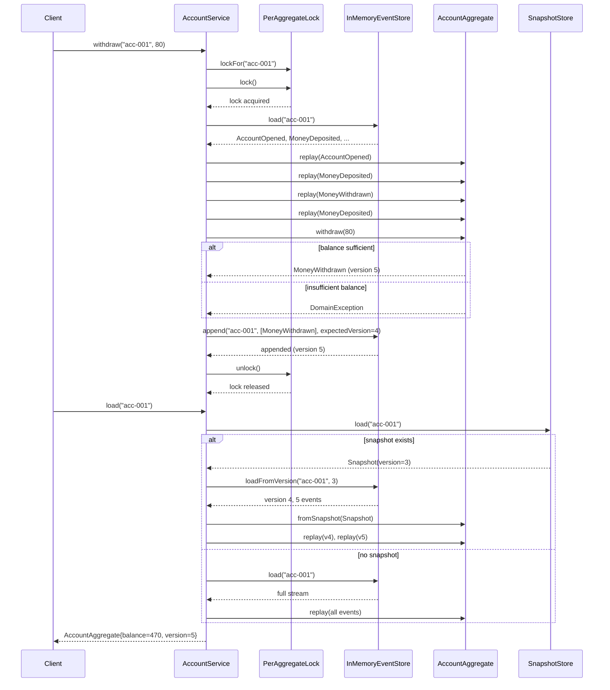

# Event Sourcing — Low-Level Design (LLD)

## 1. REQUIREMENTS & SCOPE

### 1.1 Functional Requirements

| # | Requirement |
|---|---|
| FR-1 | **Append-Only Event Store** — Store every state change as an immutable, append-only domain event keyed by aggregate ID, never modifying or deleting history. |
| FR-2 | **Aggregate Rehydration** — `AccountAggregate` rebuilds its current state by replaying its event stream from the event store (or from a snapshot + subsequent events). |
| FR-3 | **Command Path (Write Side)** — `deposit()`, `withdraw()`, and `close()` validate business invariants and emit new domain events that are persisted atomically. |
| FR-4 | **Snapshot Optimization** — A `SnapshotStore` captures a pre-computed aggregate state at a specific version so that long streams can be loaded without full replay. |
| FR-5 | **Projection (Read Side)** — A `BalanceProjection` subscribes to domain events and builds a query-optimized read model (current balance, total deposited/withdrawn, transaction count). |

### 1.2 Non-Functional Requirements

| # | Requirement |
|---|---|
| NFR-1 | **Thread-Safety & Concurrency** — Concurrent command handlers targeting the same aggregate must be serialized via a `PerAggregateLock` (pessimistic); different aggregates proceed independently. Reads (`loadStream`) return defensive copies. |
| NFR-2 | **Extensibility** — New event types, projections, and aggregate types must be addable without modifying existing components (Open/Closed Principle, sealed event hierarchies). |
| NFR-3 | **Auditability & Replayability** — The full event stream must serve as a complete audit trail, and the system must be able to replay events at any point in time (temporal queries). |
| NFR-4 | **Optimistic Concurrency Control** — Append operations must detect version conflicts (`OptimisticLockException`) to prevent lost updates in a distributed setting. |

---

## 2. GRADLE PROJECT BUILD CONFIGURATION

**File**: `build.gradle.kts`

```kotlin
// ============================================================================
// Event Sourcing Pattern — Build Configuration
// ============================================================================
// Java 25 | Gradle 9.6.1 | JUnit 5.12 | AssertJ 3.27 | Lombok 1.18.38
// ============================================================================

plugins {
    `java`
    `application`
}

group = "com.javastarterkit.patterns"
version = "1.0.0-SNAPSHOT"

// Access the version catalog programmatically for included-build compatibility
val libs = rootProject.extensions
    .getByType<org.gradle.api.artifacts.VersionCatalogsExtension>()
    .named("libs")

java {
    toolchain {
        languageVersion = JavaLanguageVersion.of(
            libs.findVersion("java-language").get().displayName
        )
        vendor = org.gradle.jvm.toolchain.JvmVendorSpec.AMAZON
    }
}

application {
    mainClass.set("com.javastarterkit.patterns.eventsourcing.Main")
}

dependencies {
    // ── Lombok: boilerplate reduction (constructor / getter generation) ──────
    compileOnly(libs.findLibrary("lombok").get())
    annotationProcessor(libs.findLibrary("lombok").get())

    testCompileOnly(libs.findLibrary("lombok").get())
    testAnnotationProcessor(libs.findLibrary("lombok").get())

    // ── Logging ─────────────────────────────────────────────────────────────
    implementation(libs.findLibrary("slf4j-api").get())
    runtimeOnly(libs.findLibrary("logback-classic").get())

    // ── Testing ─────────────────────────────────────────────────────────────
    testImplementation(platform(libs.findLibrary("junit.bom").get()))
    testImplementation(libs.findLibrary("junit.jupiter").get())
    testImplementation(libs.findLibrary("assertj.core").get())
    testRuntimeOnly(libs.findLibrary("junit.platform.launcher").get())
}

// ── Compiler flags ───────────────────────────────────────────────────────────
tasks.withType<JavaCompile> {
    options.encoding = "UTF-8"
    options.compilerArgs.add("-Xlint:unchecked")
    options.compilerArgs.add("-Xlint:deprecation")
    options.compilerArgs.add("-Xlint:rawtypes")
    options.compilerArgs.add("-parameters")
}

tasks.test {
    useJUnitPlatform()
    testLogging {
        events("passed", "skipped", "failed")
        showStandardStreams = true
        showExceptions = true
        showCauses = true
        showStackTraces = true
    }
    // Java 25+ JVM compatibility settings
    jvmArgs(
        "-XX:+EnableDynamicAgentLoading",
        "-Xshare:off"
    )
}
```

---

## 3. LLD DIAGRAMS (MERMAID.JS)

### 3.1 Class Diagram

```mermaid
classDiagram
    direction TB

    class DomainEvent {
        <<sealed interface>>
        +String aggregateId()
        +Instant timestamp()
        +long version()
    }

    class AccountOpened {
        <<record>>
        +String aggregateId
        +String owner
        +int initialBalance
        +Instant timestamp
        +long version
    }

    class MoneyDeposited {
        <<record>>
        +String aggregateId
        +int amount
        +Instant timestamp
        +long version
    }

    class MoneyWithdrawn {
        <<record>>
        +String aggregateId
        +int amount
        +Instant timestamp
        +long version
    }

    class AccountClosed {
        <<record>>
        +String aggregateId
        +Instant timestamp
        +long version
    }

    class AccountAggregate {
        -String id
        -String owner
        -int balance
        -boolean closed
        -long version
        -List~DomainEvent~ uncommittedEvents
        +AccountAggregate(String id)
        +String id()
        +String owner()
        +int balance()
        +boolean isClosed()
        +long version()
        +static AccountAggregate open(String id, String owner, int initialBalance)
        +void deposit(int amount)
        +void withdraw(int amount)
        +void close()
        +void replay(DomainEvent event)
        +List~DomainEvent~ pullUncommittedEvents()
        -void apply(DomainEvent event)
        -void handle(DomainEvent event)
    }

    class EventStore {
        <<interface>>
        +void append(String aggregateId, List~DomainEvent~ events, long expectedVersion)
        +List~DomainEvent~ load(String aggregateId)
        +List~DomainEvent~ loadFromVersion(String aggregateId, long fromVersion)
        +long latestVersion(String aggregateId)
    }

    class InMemoryEventStore {
        -ConcurrentMap~String, List~DomainEvent~~ streams
        +void append(String aggregateId, List~DomainEvent~ events, long expectedVersion)
        +List~DomainEvent~ load(String aggregateId)
        +List~DomainEvent~ loadFromVersion(String aggregateId, long fromVersion)
        +long latestVersion(String aggregateId)
    }

    class PerAggregateLock {
        -ConcurrentMap~String, Lock~ locks
        +Lock lockFor(String aggregateId)
        +void release(String aggregateId)
    }

    class Snapshot {
        <<record>>
        +long version
        +AccountState state
        +static Snapshot take(AccountAggregate account)
    }

    class SnapshotStore {
        -ConcurrentMap~String, Snapshot~ snapshots
        +void save(String aggregateId, Snapshot snapshot)
        +Optional~Snapshot~ load(String aggregateId)
    }

    class AccountState {
        <<record>>
        +String id
        +String owner
        +int balance
        +boolean closed
    }

    class BalanceProjection {
        -int totalDeposited
        -int totalWithdrawn
        -int currentBalance
        -int transactionCount
        +void onEvent(DomainEvent event)
        +int totalDeposited()
        +int totalWithdrawn()
        +int currentBalance()
        +int transactionCount()
    }

    class AccountService {
        -EventStore eventStore
        -SnapshotStore snapshotStore
        -PerAggregateLock lock
        +AccountService(EventStore eventStore, SnapshotStore snapshotStore, PerAggregateLock lock)
        +AccountAggregate load(String aggregateId)
        +void openAccount(String id, String owner, int initialBalance)
        +void deposit(String aggregateId, int amount)
        +void withdraw(String aggregateId, int amount)
        +void closeAccount(String aggregateId)
        +void takeSnapshot(String aggregateId)
        -AccountAggregate loadWithLock(String aggregateId, java.util.concurrent.locks.Lock lock)
        -void save(AccountAggregate aggregate)
    }

    class DomainException {
        <<exception>>
        +DomainException(String message)
    }

    class OptimisticLockException {
        <<exception>>
        +OptimisticLockException(String message)
    }

    class AggregateNotFoundException {
        <<exception>>
        +AggregateNotFoundException(String message)
    }

    DomainEvent <|-- AccountOpened
    DomainEvent <|-- MoneyDeposited
    DomainEvent <|-- MoneyWithdrawn
    DomainEvent <|-- AccountClosed

    EventStore <|.. InMemoryEventStore
    AccountAggregate o-- DomainEvent : "applies / emits"
    Snapshot --> AccountState
    SnapshotStore o-- Snapshot : "stores"
    AccountService --> EventStore : "persists to"
    AccountService --> SnapshotStore : "snapshots"
    AccountService --> PerAggregateLock : "serializes"
    BalanceProjection ..> DomainEvent : "consumes"

    DomainException <|-- OptimisticLockException
    DomainException <|-- AggregateNotFoundException
    AccountAggregate ..> DomainException : "throws"
    InMemoryEventStore ..> OptimisticLockException : "throws"
    AccountService ..> AggregateNotFoundException : "throws"
```



### 3.2 Sequence Diagram — Withdraw Funds End-to-End Flow



---

## 4. SYSTEM IMPLEMENTATION DETAILS & CODE

### 4.1 Package Structure

```
com.javastarterkit.patterns.eventsourcing
├── domain/
│   ├── event/
│   │   ├── DomainEvent.java         (sealed interface)
│   │   ├── AccountOpened.java       (record)
│   │   ├── MoneyDeposited.java      (record)
│   │   ├── MoneyWithdrawn.java      (record)
│   │   └── AccountClosed.java       (record)
│   └── model/
│       └── AccountAggregate.java    (aggregate root)
├── infrastructure/
│   ├── EventStore.java              (interface)
│   ├── InMemoryEventStore.java      (thread-safe impl)
│   ├── PerAggregateLock.java        (pessimistic locking)
│   ├── SnapshotStore.java           (snapshot storage)
│   └── Snapshot.java                (record)
├── application/
│   ├── service/
│   │   └── AccountService.java      (application service / command handler)
│   └── projection/
│       └── BalanceProjection.java   (read model)
├── exception/
│   ├── DomainException.java
│   ├── OptimisticLockException.java
│   └── AggregateNotFoundException.java
└── Main.java                        (entry point)
```

### 4.2 Concurrency / Thread-Safety Strategy

| Construct | Where Used | Purpose |
|---|---|---|
| `ConcurrentHashMap<String, List<DomainEvent>>` | `InMemoryEventStore.streams` | Lock-free reads/writes for different aggregates; `compute()` provides atomic read-modify-write per key |
| `ConcurrentHashMap<String, Lock>` | `PerAggregateLock.locks` | Registry of per-aggregate `ReentrantLock`s; `computeIfAbsent` ensures a single lock instance per aggregate |
| `ReentrantLock` | `PerAggregateLock.lockFor()` | Serializes the full load-mutate-save cycle per aggregate (pessimistic concurrency control) |
| `compute()` / `computeIfAbsent()` | `InMemoryEventStore.append()` | Atomic read-modify-write to detect version conflicts without external locking |
| `Collections.unmodifiableList(new ArrayList<>(...))` | `InMemoryEventStore.load()` | Defensive copies so readers never observe a partially-constructed stream |
| Immutable `record` events | `domain/event/*.java` | Events are inherently immutable (no external mutation of history) |
| `AtomicLong` | `InMemoryEventStore` version tracking | Consistent monotonic version numbers for optimistic locking |

### 4.3 Key Implementation Design Decisions

1. **Pessimistic locking by aggregate** — The `PerAggregateLock` ensures only one thread mutates a given aggregate at a time. Combined with `ConcurrentHashMap.compute()` in the event store, this provides a **double protection** barrier against lost updates.

2. **Optimistic locking on append** — The `EventStore.append(aggregateId, events, expectedVersion)` contract throws `OptimisticLockException` if the stream's latest version does not match `expectedVersion`. This protects against races even in a distributed deployment.

3. **Sealed event hierarchy** — `DomainEvent` is a `sealed interface` permitting exactly four event types. Java's pattern-matching switch (`case AccountOpened e -> ...`) guarantees exhaustiveness at compile time.

4. **Uncommitted events buffering** — `AccountAggregate` buffers events during command processing and exposes them via `pullUncommittedEvents()`. The `AccountService` persists them as a single batch and then clears the buffer — atomic unit-of-work semantics.

5. **Command/query separation of concern** — The write side (`AccountService` + `AccountAggregate`) and read side (`BalanceProjection`) are decoupled. The projection consumes events as they are appended, enabling eventual consistency in a production system.

### 4.4 Run Commands

```bash
# Build the pattern
./gradlew :design-patterns:system-design-pattern:architectural:event-sourcing:build

# Run the application
./gradlew :design-patterns:system-design-pattern:architectural:event-sourcing:run

# Run tests
./gradlew :design-patterns:system-design-pattern:architectural:event-sourcing:test
```

### 4.5 Test Coverage

| Test Class | Coverage |
|---|---|
| `EventSourcingTest.java` | Open account, deposit, withdraw, close, replay from snapshot, projection, event store version conflict (optimistic lock) |
| `EventSourcingConcurrencyTest.java` | 16 threads × 100 withdraw/deposit operations on the same aggregate; verifies final balance and event count are deterministic |