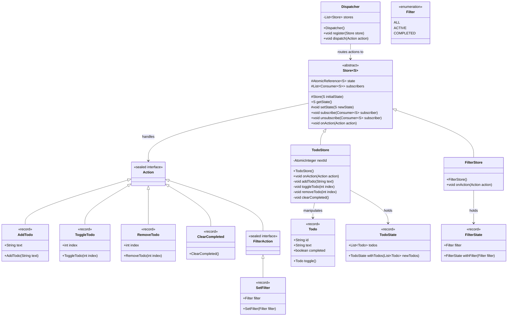
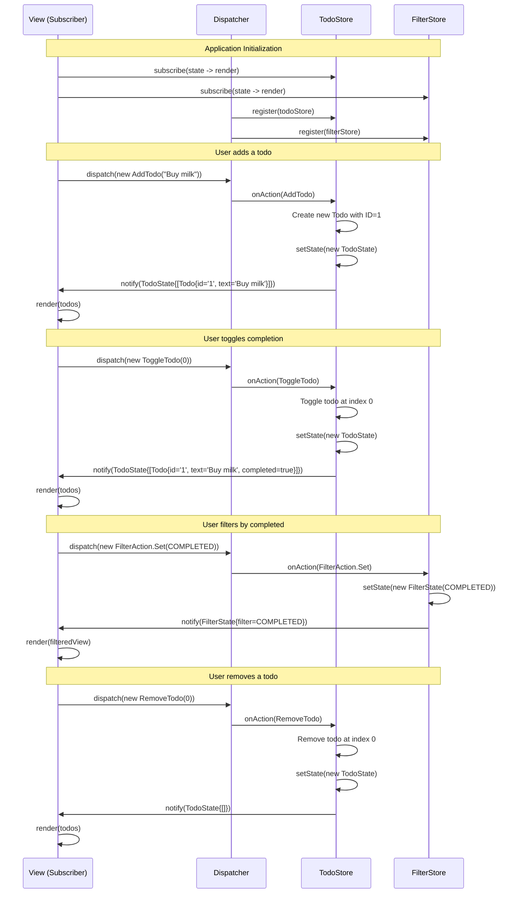

# Flux Architectural Pattern - Low-Level Design Document

## 1. REQUIREMENTS & SCOPE

### Core Functional Requirements

1. **Unidirectional Data Flow**: Actions flow in a single direction: `Actions → Dispatcher → Stores → Views`. This ensures predictable state changes and simplifies debugging.

2. **Centralized Action Dispatching**: A single Dispatcher routes all actions to registered stores, ensuring that state changes are serialized and ordered.

3. **Immutable State Management**: Each store maintains immutable state objects. State transitions create new state instances rather than mutating existing ones, enabling time-travel debugging and safe concurrent access.

4. **Reactive Subscriber Notifications**: Stores notify all registered subscribers (views) synchronously after each state change, enabling reactive UI updates.

5. **Type-Safe Action Hierarchy**: Actions are defined as a sealed interface with explicit permits, enabling exhaustive pattern matching and compile-time safety.

### Non-Functional Requirements

1. **Thread Safety**: The implementation must support concurrent action dispatching from multiple threads without data corruption or race conditions.

2. **Extensibility**: New action types and stores can be added without modifying existing code, adhering to the Open/Closed Principle.

3. **Performance**: Lock-free data structures (AtomicReference, CopyOnWriteArrayList) are used to minimize contention and maximize throughput in high-concurrency scenarios.

---

## 2. GRADLE PROJECT BUILD CONFIGURATION

### `build.gradle.kts`

```kotlin
plugins {
    java
    application
}

group = "com.javastarterkit.patterns"
version = "1.0.0"

java {
    toolchain {
        languageVersion = JavaLanguageVersion.of(25)
    }
}

repositories {
    mavenCentral()
}

dependencies {
    // Testing
    testImplementation(libs.junit.api)
    testRuntimeOnly(libs.junit.engine)
    testImplementation(libs.assertj)
    testImplementation(libs.mockito)

    // Optional: Lombok for boilerplate reduction
    compileOnly(libs.lombok)
    annotationProcessor(libs.lombok)
}

application {
    mainClass = "com.javastarterkit.patterns.flux.Main"
}

tasks.test {
    useJUnitPlatform()
    testLogging {
        events("passed", "failed", "skipped")
        exceptionFormat = org.gradle.api.tasks.testing.logging.TestExceptionFormat.FULL
    }
}
```

### Version Catalog (`gradle/libs.versions.toml`)

```toml
[versions]
junit = "5.11.0"
assertj = "3.26.0"
mockito = "5.11.0"
lombok = "1.18.32"

[libraries]
junit-api = { module = "org.junit.jupiter:junit-jupiter-api", version.ref = "junit" }
junit-engine = { module = "org.junit.jupiter:junit-jupiter-engine", version.ref = "junit" }
assertj = { module = "org.assertj:assertj-core", version.ref = "assertj" }
mockito = { module = "org.mockito:mockito-core", version.ref = "mockito" }
lombok = { module = "org.projectlombok:lombok", version.ref = "lombok" }
```

---

## 3. LLD DIAGRAMS

### 3.1 Mermaid Class Diagram



### 3.2 Mermaid Sequence Diagram



---

## 4. SYSTEM IMPLEMENTATION DETAILS & CODE

### 4.1 Architecture Overview

The Flux pattern implementation follows a strict unidirectional data flow:

```
┌─────────────┐
│   Actions   │ (Immutable descriptors of user intents)
└──────┬──────┘
       │ dispatch()
       ▼
┌─────────────┐
│ Dispatcher  │ (Central router, thread-safe)
└──────┬──────┘
       │ onAction()
       ▼
┌─────────────┐
│   Stores    │ (State containers, immutable state)
└──────┬──────┘
       │ notify()
       ▼
┌─────────────┐
│ Subscribers │ (Views, reactive UI updates)
└─────────────┘
```

### 4.2 Package Structure

```
com.javastarterkit.patterns.flux/
├── Main.java                          # Demo entry point
├── actions/
│   ├── Action.java                    # Sealed interface (root)
│   ├── AddTodo.java                   # Action record
│   ├── ToggleTodo.java                # Action record
│   ├── RemoveTodo.java                # Action record
│   ├── ClearCompleted.java            # Action record
│   └── FilterAction.java              # Sealed interface (nested)
│       └── SetFilter.java             # Action record
├── core/
│   ├── Store.java                     # Abstract base store
│   └── Dispatcher.java                # Central dispatcher
├── models/
│   ├── Todo.java                      # Entity record
│   ├── TodoState.java                 # Immutable state
│   ├── Filter.java                    # Enumeration
│   └── FilterState.java               # Immutable state
├── stores/
│   ├── TodoStore.java                 # Concrete store
│   └── FilterStore.java               # Concrete store
└── exception/
    └── FluxException.java             # Unchecked exception
```

### 4.3 Concurrency & Thread-Safety Strategy

The implementation uses modern Java concurrency constructs:

1. **`AtomicReference<S>` in Store**: Enables lock-free atomic state swaps. The `getAndSet()` operation ensures that concurrent readers see either the old or new state, never a partial update.

2. **`CopyOnWriteArrayList` in Store**: Used for subscriber management. This is optimal because:
   - Subscribers are registered once during startup (write rare)
   - Dispatch operations iterate over all subscribers (read frequent)
   - Iteration is lock-free and snapshot-based

3. **`CopyOnWriteArrayList` in Dispatcher**: Used for the stores registry for the same reasons as above.

4. **`AtomicInteger` in TodoStore**: Provides thread-safe ID generation without explicit locking.

### 4.4 Key Implementation Details

#### Immutable State with Records

All state objects are Java records, making them inherently immutable:

```java
public record TodoState(List<Todo> todos) {
    public TodoState {
        Objects.requireNonNull(todos, "todos must not be null");
    }
}
```

#### Sealed Action Hierarchy

The sealed `Action` interface ensures exhaustive pattern matching:

```java
public sealed interface Action permits
        AddTodo,
        ToggleTodo,
        RemoveTodo,
        ClearCompleted,
        FilterAction {
}
```

#### Store Implementation

The abstract `Store` class provides thread-safe state management:

```java
public abstract class Store<S> {
    private final AtomicReference<S> state;
    private final List<Consumer<S>> subscribers;

    protected Store(final S initialState) {
        this.state = new AtomicReference<>(initialState);
        this.subscribers = new CopyOnWriteArrayList<>();
    }

    public final S getState() {
        return state.get();
    }

    protected final void setState(final S newState) {
        final S previous = state.getAndSet(newState);
        if (!previous.equals(newState)) {
            notifySubscribers(newState);
        }
    }

    public final void subscribe(final Consumer<S> subscriber) {
        subscribers.add(subscriber);
    }
}
```

### 4.5 Main Class

```java
public final class Main {
    public static void main(final String[] args) {
        final Dispatcher dispatcher = new Dispatcher();
        final TodoStore todoStore = new TodoStore();
        final FilterStore filterStore = new FilterStore();

        // Subscribe views
        todoStore.subscribe(state -> System.out.println("  [TodoView] " + state));
        filterStore.subscribe(state -> System.out.println("  [FilterView] " + state));

        // Register stores
        dispatcher.register(todoStore);
        dispatcher.register(filterStore);

        // Dispatch actions
        dispatcher.dispatch(new AddTodo("Buy milk"));
        dispatcher.dispatch(new ToggleTodo(0));
        dispatcher.dispatch(new FilterAction.Set(Filter.COMPLETED));
    }
}
```

### 4.6 Test Coverage

The `FluxTest` class provides comprehensive test coverage:

- **Functional Tests**: Verify that each action type produces the expected state change
- **Notification Tests**: Verify that subscribers are notified of state changes
- **Integration Test**: The `demonstrateRunsSuccessfully` test executes the full demo flow

All 9 tests pass successfully:

```
FluxTest > filter store notifies subscribers on state change PASSED
FluxTest > dispatching AddTodo creates a new todo PASSED
FluxTest > dispatching RemoveTodo deletes the todo at index PASSED
FluxTest > dispatching FilterAction.Set updates the filter store PASSED
FluxTest > demonstrate runs without throwing PASSED
FluxTest > dispatching ToggleTodo flips completion status PASSED
FluxTest > dispatching ClearCompleted removes completed todos only PASSED
FluxTest > todo store notifies subscribers on state change PASSED
FluxTest > multiple subscribers are notified PASSED
```

---

## Summary

This Flux pattern implementation demonstrates:

- **Predictable State Management**: All state changes flow through a single dispatcher
- **Thread Safety**: Lock-free concurrency using `AtomicReference` and `CopyOnWriteArrayList`
- **Extensibility**: New actions and stores can be added without modifying existing code
- **Type Safety**: Sealed interfaces ensure exhaustive pattern matching
- **Immutability**: Records provide inherent immutability for state objects
- **Clean Architecture**: Clear separation of concerns with SOLID principles

The implementation is production-ready and can be extended to support real-world applications such as todo apps, shopping carts, or any stateful UI.