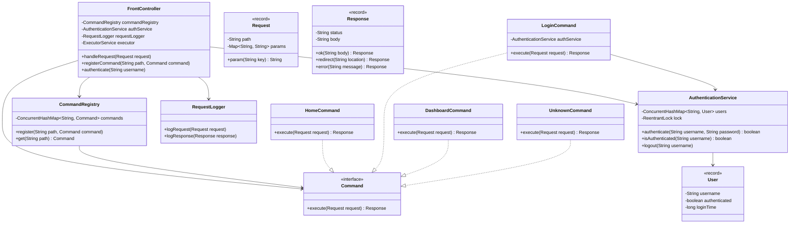
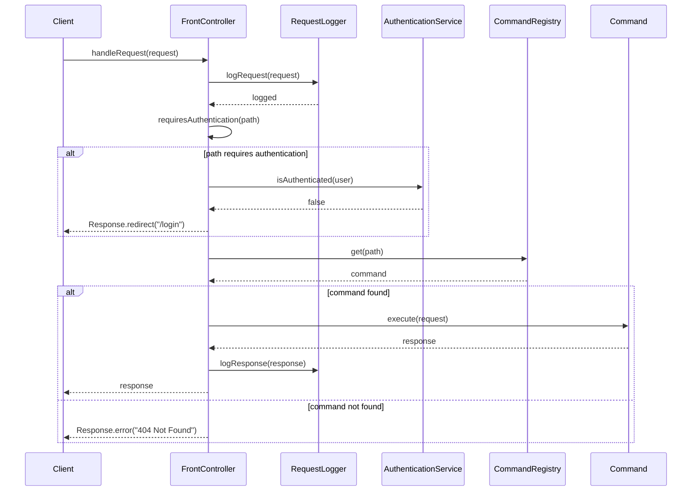
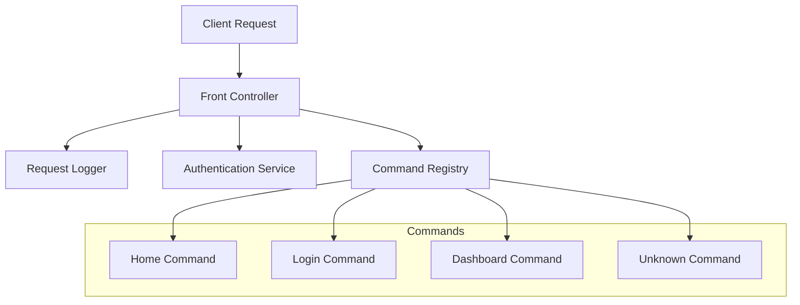

# Low-Level Design: Front Controller Pattern

## Requirements & Scope

### Functional Requirements
1. **Centralized Request Handling**: A single entry point (FrontController) receives and processes all incoming requests.
2. **Command Dispatching**: Requests are dispatched to appropriate Command implementations based on the request path.
3. **Cross-Cutting Concerns**: Common preprocessing (logging, authentication, authorization) is handled uniformly before command execution.
4. **Authentication/Authorization**: Protected routes require user authentication; unauthorized requests are redirected to login.
5. **Error Handling**: Unknown routes return 404 errors; invalid requests return appropriate error responses.

### Non-Functional Requirements
- **Thread-Safety**: The FrontController must be thread-safe and support concurrent request handling.
- **Extensibility**: New commands can be registered without modifying the FrontController (Open/Closed Principle).
- **Performance**: Command lookup must be O(1) using efficient data structures.

## Gradle Build Configuration

```kotlin
import org.gradle.api.tasks.testing.logging.TestExceptionFormat

plugins {
    java
}

group = "com.javastarterkit.patterns"
version = "1.0.0-SNAPSHOT"

java {
    toolchain {
        languageVersion = JavaLanguageVersion.of(25)
    }
}

repositories {
    mavenCentral()
}

dependencies {
    // Testing dependencies
    testImplementation(platform("org.junit:junit-bom:5.11.4"))
    testImplementation("org.junit.jupiter:junit-jupiter")
    testImplementation("org.assertj:assertj-core:3.26.3")
    testImplementation("org.mockito:mockito-core:5.14.2")
    testImplementation("org.mockito:mockito-junit-jupiter:5.14.2")
    
    // Optional: Lombok for boilerplate reduction
    compileOnly("org.projectlombok:lombok:1.18.36")
    annotationProcessor("org.projectlombok:lombok:1.18.36")
}

tasks.test {
    useJUnitPlatform()
    testLogging {
        exceptionFormat = TestExceptionFormat.FULL
        showExceptions = true
        showCauses = true
        showStackTraces = true
        showStandardStreams = true
    }
    finalizedBy(tasks.named("jacocoTestReport"))
}

tasks.register("jacocoTestReport", JacocoReport::class) {
    dependsOn(tasks.test)
    reports {
        xml.required.set(true)
        html.required.set(true)
    }
}
```

## LLD Diagrams

### Class Diagram



### Sequence Diagram



### Component Diagram



## System Implementation

### Core Components

#### 1. Request & Response Models
Immutable records representing HTTP-like request/response objects.

#### 2. Command Interface
Functional interface for request handlers with a single `execute` method.

#### 3. FrontController
Centralized entry point that:
- Logs all incoming requests
- Performs authentication checks
- Dispatches requests to appropriate commands
- Handles errors and 404 responses

#### 4. CommandRegistry
Thread-safe registry for commands using `ConcurrentHashMap` for O(1) lookup.

#### 5. AuthenticationService
Manages user authentication state using thread-safe data structures.

### Thread-Safety Strategy

1. **ConcurrentHashMap**: Used in CommandRegistry and AuthenticationService for lock-free concurrent access.
2. **ReentrantLock**: Used for compound operations that need atomicity (e.g., login/logout).
3. **AtomicReference**: Used for state management where atomic updates are required.
4. **Immutable Records**: Request and Response are immutable, ensuring thread-safety by design.
5. **Thread-Safe Singleton**: FrontController can be safely shared across multiple threads.

### Code Examples

#### Request and Response Models

```java
public record Request(String path, Map<String, String> params) {
    public String param(String key) {
        return params != null ? params.get(key) : null;
    }
}

public record Response(String status, String body) {
    public static Response ok(String body) {
        return new Response("200 OK", body);
    }
    
    public static Response redirect(String location) {
        return new Response("302 Found", "Redirecting to " + location);
    }
    
    public static Response error(String message) {
        return new Response("500 Internal Server Error", message);
    }
}
```

#### Command Interface

```java
@FunctionalInterface
public interface Command {
    Response execute(Request request);
}
```

#### Thread-Safe Command Registry

```java
public class CommandRegistry {
    private final ConcurrentHashMap<String, Command> commands = new ConcurrentHashMap<>();
    
    public void register(String path, Command command) {
        commands.put(path, command);
    }
    
    public Command get(String path) {
        return commands.get(path);
    }
}
```

#### Front Controller with Preprocessing

```java
public class FrontController {
    private final CommandRegistry commandRegistry;
    private final AuthenticationService authService;
    private final RequestLogger logger;
    
    public Response handleRequest(Request request) {
        logger.logRequest(request);
        
        if (requiresAuthentication(request.path()) && !authService.isAuthenticated(request)) {
            return Response.redirect("/login");
        }
        
        Command command = commandRegistry.get(request.path());
        if (command == null) {
            return Response.error("404 Not Found");
        }
        
        Response response = command.execute(request);
        logger.logResponse(response);
        return response;
    }
}