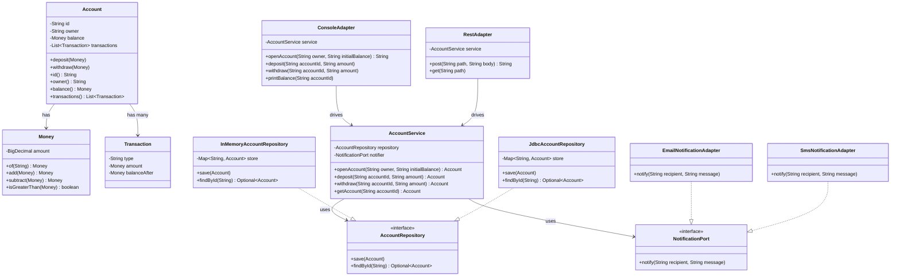
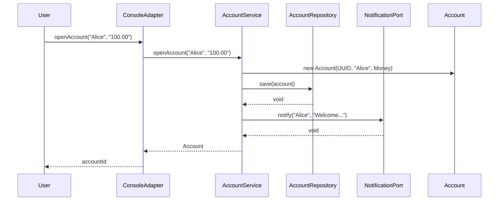
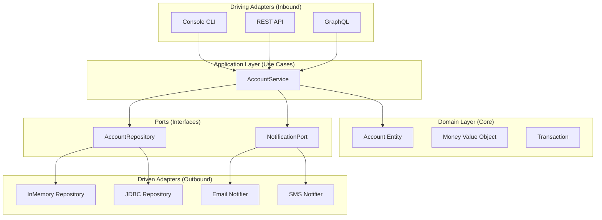

# Low-Level Design: Hexagonal Architecture (Ports & Adapters)

## Requirements & Scope

### Functional Requirements
1. **Domain Isolation**: Core business logic must be completely isolated from external concerns (frameworks, databases, UIs, APIs).
2. **Port Definitions**: Clear interface contracts (ports) that define how the application communicates with external systems.
3. **Driving Adapters**: Support multiple input mechanisms (CLI, REST API, GraphQL, gRPC) that drive the application through use cases.
4. **Driven Adapters**: Support multiple output mechanisms (databases, messaging, notifications) that are plugged into the application ports.
5. **Swappable Components**: Ability to swap adapters (e.g., in-memory repository to JDBC, email to SMS) without modifying core business logic.

### Non-Functional Requirements
- **Framework Agnostic**: Domain layer must have zero dependencies on external frameworks or infrastructure.
- **Testability**: Easy to test by mocking ports; supports unit testing without real infrastructure.
- **Extensibility**: New adapters can be added without changing existing code (Open/Closed Principle).

## Gradle Build Configuration

```kotlin
import org.gradle.api.tasks.testing.logging.TestExceptionFormat

plugins {
    java
}

group = "com.javastarterkit.patterns"
version = "1.0.0-SNAPSHOT"

java {
    toolchain {
        languageVersion = JavaLanguageVersion.of(25)
    }
}

repositories {
    mavenCentral()
}

dependencies {
    // Testing dependencies
    testImplementation(platform("org.junit:junit-bom:5.11.4"))
    testImplementation("org.junit.jupiter:junit-jupiter")
    testImplementation("org.assertj:assertj-core:3.26.3")
    testImplementation("org.mockito:mockito-core:5.14.2")
    testImplementation("org.mockito:mockito-junit-jupiter:5.14.2")
}

tasks.test {
    useJUnitPlatform()
    testLogging {
        exceptionFormat = TestExceptionFormat.FULL
        showExceptions = true
        showCauses = true
        showStackTraces = true
        showStandardStreams = true
    }
}
```

## LLD Diagrams

### Class Diagram



### Sequence Diagram



### Component Diagram



## System Implementation

### Core Components

#### 1. Domain Layer (Core)
- **Money**: Immutable value object for monetary amounts
- **Account**: Entity representing a bank account with business rules
- **Transaction**: Immutable record of account transactions

#### 2. Application Layer (Use Cases)
- **AccountService**: Orchestrates use cases (open account, deposit, withdraw, query)
- **AccountRepository**: Port (interface) for persistence
- **NotificationPort**: Port (interface) for notifications

#### 3. Driving Adapters (Inbound)
- **ConsoleAdapter**: CLI interface
- **RestAdapter**: Simulated REST API

#### 4. Driven Adapters (Outbound)
- **InMemoryAccountRepository**: In-memory persistence for testing
- **JdbcAccountRepository**: Simulated JDBC persistence
- **EmailNotificationAdapter**: Email notifications
- **SmsNotificationAdapter**: SMS notifications

### Thread-Safety Strategy

1. **Immutability**: Value objects (Money, Transaction) are immutable records
2. **Thread-Safe Collections**: Use ConcurrentHashMap for shared state in adapters
3. **No Shared Mutable State**: Domain entities are not thread-safe by design (each thread works on its own instance)
4. **Stateless Services**: Application services are stateless and can be safely shared

### Code Examples

#### Domain Model (Pure Business Logic)

```java
// Immutable value object
public record Money(BigDecimal amount) {
    static Money of(String value) {
        return new Money(new BigDecimal(value));
    }
    
    Money add(Money other) {
        return new Money(amount.add(other.amount));
    }
    
    Money subtract(Money other) {
        return new Money(amount.subtract(other.amount));
    }
}

// Entity with business rules
public class Account {
    private final String id;
    private final String owner;
    private Money balance;
    private final List<Transaction> transactions = new ArrayList<>();
    
    public void deposit(Money amount) {
        if (amount.amount().signum() <= 0) {
            throw new IllegalArgumentException("Deposit amount must be positive");
        }
        balance = balance.add(amount);
        transactions.add(new Transaction("DEPOSIT", amount, balance));
    }
    
    public void withdraw(Money amount) {
        if (amount.amount().signum() <= 0) {
            throw new IllegalArgumentException("Withdrawal amount must be positive");
        }
        if (amount.isGreaterThan(balance)) {
            throw new IllegalStateException("Insufficient funds");
        }
        balance = balance.subtract(amount);
        transactions.add(new Transaction("WITHDRAW", amount, balance));
    }
}
```

#### Application Service (Use Case Orchestrator)

```java
public class AccountService {
    private final AccountRepository repository;
    private final NotificationPort notifier;
    
    public AccountService(AccountRepository repository, NotificationPort notifier) {
        this.repository = repository;
        this.notifier = notifier;
    }
    
    public Account openAccount(String owner, String initialBalance) {
        Account account = new Account(UUID.randomUUID().toString(), owner, Money.of(initialBalance));
        repository.save(account);
        notifier.notify(owner, "Welcome! Account " + account.id() + " opened");
        return account;
    }
    
    public Account deposit(String accountId, String amount) {
        Account account = getAccount(accountId);
        account.deposit(Money.of(amount));
        repository.save(account);
        notifier.notify(account.owner(), "Deposited " + amount);
        return account;
    }
}
```

#### Port (Interface)

```java
public interface AccountRepository {
    void save(Account account);
    Optional<Account> findById(String id);
}
```

#### Driven Adapter (Implementation)

```java
public class InMemoryAccountRepository implements AccountRepository {
    private final Map<String, Account> store = new ConcurrentHashMap<>();
    
    @Override
    public void save(Account account) {
        store.put(account.id(), account);
    }
    
    @Override
    public Optional<Account> findById(String id) {
        return Optional.ofNullable(store.get(id));
    }
}
```

#### Driving Adapter (Input Mechanism)

```java
public class ConsoleAdapter {
    private final AccountService service;
    
    public ConsoleAdapter(AccountService service) {
        this.service = service;
    }
    
    public String openAccount(String owner, String initialBalance) {
        Account account = service.openAccount(owner, initialBalance);
        System.out.println("Opened account " + account.id() + " for " + owner);
        return account.id();
    }
}