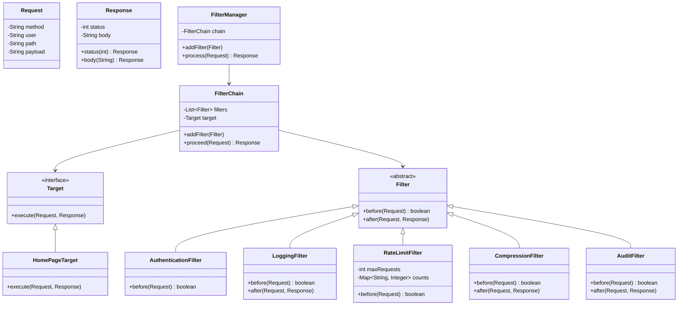
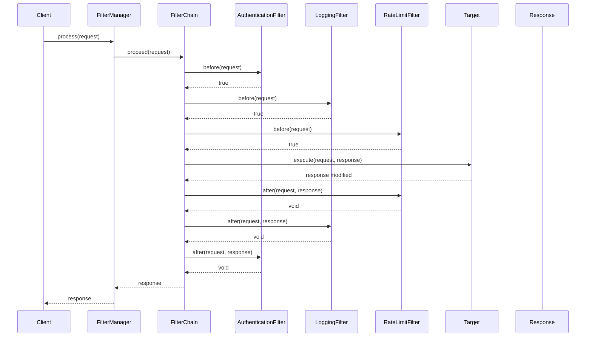
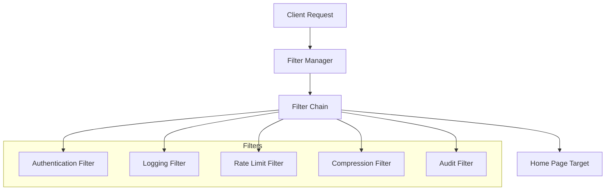

# Low-Level Design: Intercepting Filter Pattern

## Requirements & Scope

### Functional Requirements
1. **Filter Chain Execution**: Process requests through an ordered chain of reusable filters before reaching the target handler.
2. **Before/After Hooks**: Each filter can execute logic before and after the target handler, enabling pre-processing and post-processing.
3. **Chain Abortion**: Filters can abort the chain by returning false, preventing the request from reaching the target handler.
4. **Configurable Filter Order**: Filters can be added in any order and execute in that sequence (before hooks) or reverse order (after hooks).
5. **Cross-Cutting Concern Isolation**: Separate concerns like authentication, logging, compression, rate-limiting into independent filters.

### Non-Functional Requirements
- **Thread-Safety**: Filter chain and filters must be thread-safe for concurrent request processing.
- **Extensibility**: New filters can be added without modifying existing filters or the target handler (Open/Closed Principle).
- **Performance**: Filter execution should have minimal overhead; filters should be stateless where possible.

## Gradle Build Configuration

```kotlin
import org.gradle.api.tasks.testing.logging.TestExceptionFormat

plugins {
    java
}

group = "com.javastarterkit.patterns"
version = "1.0.0-SNAPSHOT"

java {
    toolchain {
        languageVersion = JavaLanguageVersion.of(25)
    }
}

repositories {
    mavenCentral()
}

dependencies {
    // Testing dependencies
    testImplementation(platform("org.junit:junit-bom:5.11.4"))
    testImplementation("org.junit.jupiter:junit-jupiter")
    testImplementation("org.assertj:assertj-core:3.26.3")
    testImplementation("org.mockito:mockito-core:5.14.2")
    testImplementation("org.mockito:mockito-junit-jupiter:5.14.2")
}

tasks.test {
    useJUnitPlatform()
    testLogging {
        exceptionFormat = TestExceptionFormat.FULL
        showExceptions = true
        showCauses = true
        showStackTraces = true
        showStandardStreams = true
    }
}
```

## LLD Diagrams

### Class Diagram



### Sequence Diagram



### Component Diagram



## System Implementation

### Core Components

#### 1. Request/Response Models
- **Request**: Immutable record carrying HTTP method, user, path, and payload
- **Response**: Mutable response object with status and body

#### 2. Filter Interface
Abstract base class with `before()` and `after()` hooks. Returning false from `before()` aborts the chain.

#### 3. FilterChain
Manages ordered list of filters and invokes them around the target. Executes before hooks in order, target, then after hooks in reverse order.

#### 4. Target Interface
The actual business handler that fulfills the request.

#### 5. FilterManager
Entry point that owns the filter chain and exposes a simple `process()` method.

#### 6. Concrete Filters
- **AuthenticationFilter**: Validates user authentication
- **LoggingFilter**: Logs requests and responses
- **RateLimitFilter**: Limits requests per user
- **CompressionFilter**: Compresses response body
- **AuditFilter**: Audits requests after processing

### Thread-Safety Strategy

1. **Immutable Request**: Request is an immutable record, thread-safe by design
2. **Thread-Safe Filters**: Filters like RateLimitFilter use ConcurrentHashMap for thread-safe state management
3. **Stateless Filters**: Most filters are stateless and thread-safe
4. **Local Response**: Each request gets its own Response instance, no shared mutable state

### Code Examples

#### Filter Chain Execution

```java
public class FilterChain {
    private final List<Filter> filters = new ArrayList<>();
    private final Target target;
    
    public Response proceed(Request request) {
        Response response = new Response();
        
        // Execute before hooks
        for (Filter filter : filters) {
            if (!filter.before(request)) {
                response.status(403).body("Blocked by " + filter);
                return response;
            }
        }
        
        // Execute target
        target.execute(request, response);
        
        // Execute after hooks in reverse order
        for (int i = filters.size() - 1; i >= 0; i--) {
            filters.get(i).after(request, response);
        }
        
        return response;
    }
}
```

#### Thread-Safe Rate Limit Filter

```java
public class RateLimitFilter extends Filter {
    private final int maxRequests;
    private final ConcurrentHashMap<String, AtomicInteger> counts = new ConcurrentHashMap<>();
    
    @Override
    boolean before(Request request) {
        AtomicInteger count = counts.computeIfAbsent(request.user(), 
            k -> new AtomicInteger(0));
        if (count.incrementAndGet() > maxRequests) {
            return false; // Abort chain
        }
        return true;
    }
}
```

#### Authentication Filter

```java
public class AuthenticationFilter extends Filter {
    @Override
    boolean before(Request request) {
        if (request.user() == null || request.user().isEmpty()) {
            System.out.println("Rejecting unauthenticated request");
            return false; // Abort chain
        }
        System.out.println("Authenticated user: " + request.user());
        return true;
    }
}