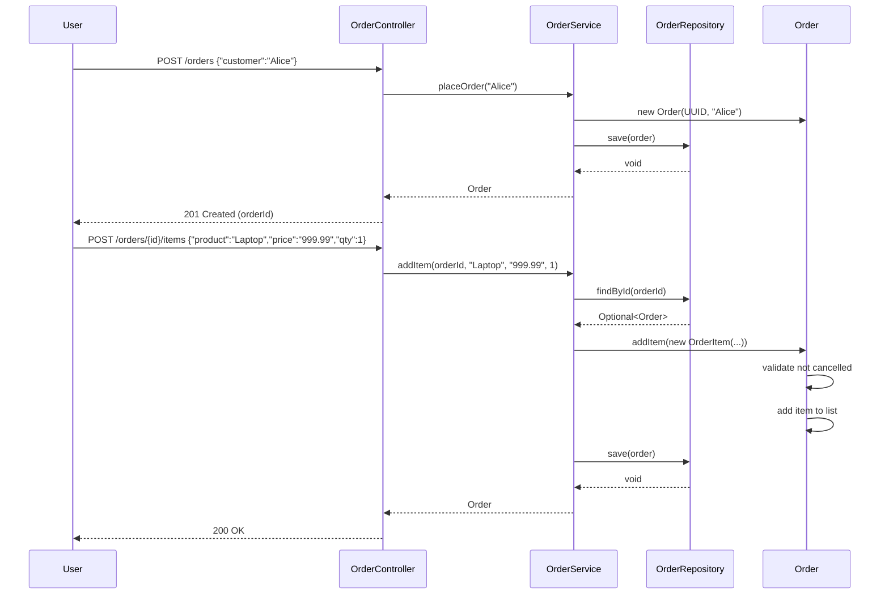
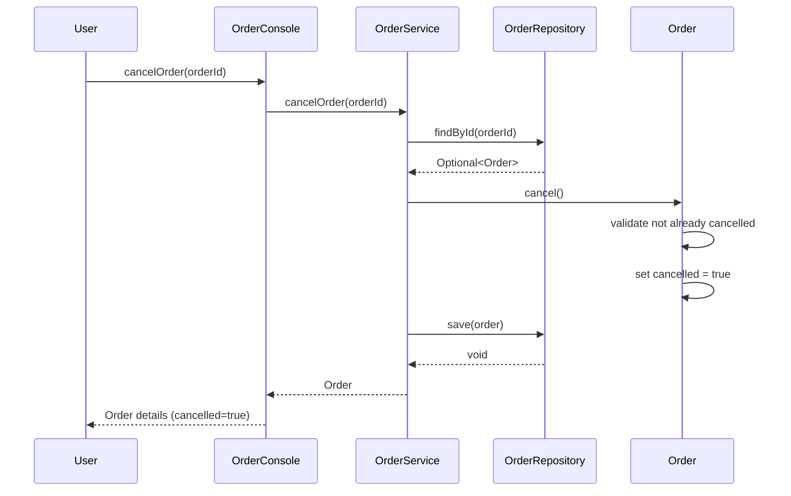

# Low-Level Design: Layered Architecture Pattern

## 1. Requirements & Scope

### Functional Requirements

1. **Layer Isolation**: The application must be organized into three horizontal layers (Presentation, Business, Persistence) where each layer depends only on the layer directly below it. No cross-layer skipping (e.g., Presentation must not bypass Business to access Persistence directly).

2. **Order Management Use Cases**: The system must support creating orders, adding line items, retrieving orders, and cancelling orders — all through both REST-style and CLI-style presentation adapters.

3. **Business Rule Enforcement**: The business layer (`OrderService`) must enforce invariants: order items cannot be added to a cancelled order, quantities must be positive, prices must be non-negative, and orders must be retrievable by ID.

4. **Pluggable Persistence**: The persistence layer must expose a repository interface (`OrderRepository`) that allows swapping between in-memory and database-backed implementations without modifying business logic.

5. **Multi-Channel Presentation**: Two presentation adapters (REST controller and CLI console) must be supported, both delegating to the same business service layer.

### Non-Functional Requirements

- **Thread-Safety**: All shared state (repositories, services) must be thread-safe for concurrent access using `ConcurrentHashMap`, `synchronized` blocks, or immutable value objects.
- **Testability**: Each layer must be independently testable with JUnit 5 and AssertJ; the persistence layer must be mockable via Mockito.
- **Extensibility**: New presentation adapters can be added without touching the business or persistence layers; new repository implementations can be swapped without touching the business layer.
- **Immutability**: Domain value objects (`Money`, `OrderItem`) must be immutable records to guarantee thread-safety and predictability.

---

## 2. Gradle Build Configuration

```kotlin
import org.gradle.api.tasks.testing.logging.TestExceptionFormat

plugins {
    java
}

group = "com.javastarterkit.patterns"
version = "1.0.0-SNAPSHOT"

java {
    toolchain {
        languageVersion = JavaLanguageVersion.of(25)
    }
}

repositories {
    mavenCentral()
}

dependencies {
    // Testing dependencies
    testImplementation(platform("org.junit:junit-bom:5.11.4"))
    testImplementation("org.junit.jupiter:junit-jupiter")
    testImplementation("org.assertj:assertj-core:3.26.3")
    testImplementation("org.mockito:mockito-core:5.14.2")
    testImplementation("org.mockito:mockito-junit-jupiter:5.14.2")
}

tasks.test {
    useJUnitPlatform()
    testLogging {
        exceptionFormat = TestExceptionFormat.FULL
        showExceptions = true
        showCauses = true
        showStackTraces = true
        showStandardStreams = true
    }
}
```

---

## 3. LLD Diagrams

### Class Diagram

```mermaid
classDiagram
    class LayeredArchitecture {
        +{static} demonstrate()
        +{static} main(String[] args)
    }

    class Money {
        <<record>>
        -BigDecimal amount
        +of(String value) Money
        +add(Money other) Money
        +multiply(int quantity) Money
        +isGreaterThan(Money other) boolean
        +toString() String
    }

    class OrderItem {
        <<record>>
        -String product
        -Money price
        -int quantity
        +total() Money
        +toString() String
    }

    class Order {
        -String id
        -String customer
        -List~OrderItem~ items
        -boolean cancelled
        +Order(String customer)
        +Order(String id, String customer)
        +id() String
        +customer() String
        +items() List~OrderItem~
        +isCancelled() boolean
        +addItem(OrderItem item)
        +cancel()
        +total() Money
        +toString() String
    }

    class OrderRepository {
        <<interface>>
        +save(Order order)
        +findById(String id) Optional~Order~
    }

    class InMemoryOrderRepository {
        -ConcurrentHashMap~String, Order~ store
        +save(Order order)
        +findById(String id) Optional~Order~
    }

    class OrderService {
        -OrderRepository repository
        +OrderService(OrderRepository repository)
        +placeOrder(String customer) Order
        +addItem(String orderId, String product, String price, int quantity) Order
        +cancelOrder(String orderId) Order
        +getOrder(String orderId) Order
    }

    class OrderController {
        -OrderService service
        +OrderController(OrderService service)
        +post(String path, String body) String
        +get(String path)
    }

    class OrderConsole {
        -OrderService service
        +OrderConsole(OrderService service)
        +placeOrder(String customer) String
        +addItem(String orderId, String product, String price, int qty)
        +printOrder(String orderId)
    }

    class LayeredArchitectureException {
        +LayeredArchitectureException(String message)
        +LayeredArchitectureException(String message, Throwable cause)
    }

    class OrderNotFoundException {
        +OrderNotFoundException(String message)
    }

    class OrderCancelledException {
        +OrderCancelledException(String message)
    }

    Order --> Money : uses
    Order --> OrderItem : contains
    OrderItem --> Money : uses
    InMemoryOrderRepository ..|> OrderRepository
    OrderService --> OrderRepository : depends on
    OrderController --> OrderService : depends on
    OrderConsole --> OrderService : depends on
    OrderService ..|> LayeredArchitectureException : throws
    OrderNotFoundException --|> LayeredArchitectureException
    OrderCancelledException --|> LayeredArchitectureException
    LayeredArchitecture --> OrderService : wires
    LayeredArchitecture --> InMemoryOrderRepository : wires
    LayeredArchitecture --> OrderController : wires
    LayeredArchitecture --> OrderConsole : wires
```

### Sequence Diagram — Place Order & Add Item



### Sequence Diagram — Cancel Order



### Component Diagram

```mermaid
graph TD
    subgraph "Presentation Layer"
        OC[OrderController<br/>REST adapter]
        OCs[OrderConsole<br/>CLI adapter]
    end

    subgraph "Business Layer"
        OS[OrderService<br/>Use case orchestrator]
    end

    subgraph "Persistence Layer"
        OR[OrderRepository<br/>Interface]
        IMR[InMemoryOrderRepository<br/>ConcurrentHashMap]
    end

    subgraph "Domain Model"
        O[Order<br/>Entity - synchronized]
        OI[OrderItem<br/>Value Object - record]
        M[Money<br/>Value Object - record]
    end

    subgraph "Exception Hierarchy"
        LAE[LayeredArchitectureException<br/>Base]
        ONFE[OrderNotFoundException]
        OCE[OrderCancelledException]
    end

    OC --> OS
    OCs --> OS
    OS --> OR
    IMR ..|> OR
    OS --> O : creates/manages
    O --> OI : contains
    OI --> M : uses
    OS ..|> LAE : throws
    ONFE --|> LAE
    OCE --|> LAE
```

---

## 4. System Implementation Details & Code

### Package Structure

```
com.javastarterkit.patterns.layeredarchitecture
├── LayeredArchitecture.java          # Main entry point (wires layers)
├── models/                           # Domain layer
│   ├── Money.java                    # Immutable value object (record)
│   ├── OrderItem.java                # Immutable value object (record)
│   └── Order.java                    # Entity with synchronized state
├── persistence/                      # Persistence layer
│   ├── OrderRepository.java          # Interface (DIP)
│   └── InMemoryOrderRepository.java  # ConcurrentHashMap implementation
├── business/                         # Business layer
│   └── OrderService.java             # Stateless use-case orchestrator
├── presentation/                     # Presentation layer
│   ├── OrderController.java          # Simulated REST adapter
│   └── OrderConsole.java             # CLI adapter
└── exception/                        # Exception hierarchy
    ├── LayeredArchitectureException.java
    ├── OrderNotFoundException.java
    └── OrderCancelledException.java
```

### Core Components

#### 1. Domain Layer (Models) — `models`

- **Money**: Immutable record wrapping `BigDecimal`. Validates non-negative amounts. Provides `add()`, `multiply()`, `isGreaterThan()` operations. Inherently thread-safe.
- **OrderItem**: Immutable record representing a line item with product name, price, and quantity. Computes `total()` as `price × quantity`. Inherently thread-safe.
- **Order**: Entity with customer, items list, and cancellation state. Uses `synchronized` blocks for thread-safe state mutations. Enforces business rules: cannot add items to cancelled orders, cannot cancel an already-cancelled order. Returns defensive copies via `List.copyOf()`.

#### 2. Persistence Layer — `persistence`

- **OrderRepository**: Interface contract defining `save()` and `findById()` operations. The business layer depends on this abstraction (Dependency Inversion Principle).
- **InMemoryOrderRepository**: Thread-safe implementation using `ConcurrentHashMap` for lock-free concurrent reads and atomic writes. Suitable for testing and demos.

#### 3. Business Layer — `business`

- **OrderService**: Stateless service that orchestrates use cases. Depends only on `OrderRepository` (not on any specific implementation). Enforces all business rules: input validation, order state management, item addition/cancellation. Thread-safe because it holds no mutable state.

#### 4. Presentation Layer — `presentation`

- **OrderController**: Simulated REST controller. Parses JSON-like request bodies and dispatches to `OrderService`. Stateless and thread-safe.
- **OrderConsole**: CLI adapter. Provides a simple text-based interface for placing orders and adding items. Stateless and thread-safe.

#### 5. Exception Hierarchy — `exception`

- **LayeredArchitectureException**: Base runtime exception for all domain errors.
- **OrderNotFoundException**: Thrown when an order ID cannot be found in the repository.
- **OrderCancelledException**: Thrown when attempting to modify a cancelled order.

### Thread-Safety Strategy

1. **Immutable Value Objects**: `Money` and `OrderItem` are immutable Java records — inherently thread-safe.
2. **Thread-Safe Repository**: `InMemoryOrderRepository` uses `ConcurrentHashMap` for lock-free concurrent reads and atomic writes.
3. **Synchronized Entity Methods**: `Order` uses `synchronized` blocks on mutable operations (`addItem`, `cancel`, `items()`, `total()`, `isCancelled()`) to ensure atomic state transitions when accessed concurrently.
4. **Stateless Service**: `OrderService` holds no mutable state — it delegates to the thread-safe repository. Can be safely shared across threads.
5. **Defensive Copies**: `Order.items()` returns `List.copyOf()` to prevent external mutation of internal state.

### Code Examples

#### Domain Value Object (Money)

```java
package com.javastarterkit.patterns.layeredarchitecture.models;

import java.math.BigDecimal;
import java.util.Objects;

/**
 * Immutable value object representing a non-negative monetary amount.
 */
public record Money(BigDecimal amount) {

    public Money {
        Objects.requireNonNull(amount, "Amount must not be null");
        if (amount.signum() < 0) {
            throw new IllegalArgumentException("Amount must be non-negative");
        }
    }

    public static Money of(String value) {
        return new Money(new BigDecimal(value));
    }

    public Money add(Money other) {
        Objects.requireNonNull(other, "Other amount must not be null");
        return new Money(amount.add(other.amount));
    }

    public Money multiply(int quantity) {
        return new Money(amount.multiply(BigDecimal.valueOf(quantity)));
    }

    public boolean isGreaterThan(Money other) {
        Objects.requireNonNull(other, "Other amount must not be null");
        return amount.compareTo(other.amount) > 0;
    }

    @Override
    public String toString() {
        return amount.toPlainString();
    }
}
```

#### Thread-Safe Entity (Order)

```java
package com.javastarterkit.patterns.layeredarchitecture.models;

import com.javastarterkit.patterns.layeredarchitecture.exception.OrderCancelledException;
import java.math.BigDecimal;
import java.util.ArrayList;
import java.util.List;
import java.util.Objects;
import java.util.UUID;

/**
 * Domain entity with synchronized state transitions.
 */
public final class Order {

    private final String id;
    private final String customer;
    private final List<OrderItem> items;
    private boolean cancelled;

    public Order(String customer) {
        this(UUID.randomUUID().toString(), customer);
    }

    public Order(String id, String customer) {
        this.id = Objects.requireNonNull(id, "Order ID must not be null");
        this.customer = Objects.requireNonNull(customer, "Customer must not be null");
        this.items = new ArrayList<>();
        this.cancelled = false;
    }

    public String id() { return id; }
    public String customer() { return customer; }

    public List<OrderItem> items() {
        synchronized (this) { return List.copyOf(items); }
    }

    public boolean isCancelled() {
        synchronized (this) { return cancelled; }
    }

    public void addItem(OrderItem item) {
        Objects.requireNonNull(item, "OrderItem must not be null");
        synchronized (this) {
            if (cancelled) {
                throw new OrderCancelledException("Cannot add items to cancelled order: " + id);
            }
            items.add(item);
        }
    }

    public void cancel() {
        synchronized (this) {
            if (cancelled) {
                throw new OrderCancelledException("Order is already cancelled: " + id);
            }
            cancelled = true;
        }
    }

    public Money total() {
        synchronized (this) {
            return items.stream()
                    .map(OrderItem::total)
                    .reduce(new Money(BigDecimal.ZERO), Money::add);
        }
    }
}
```

#### Thread-Safe Repository

```java
package com.javastarterkit.patterns.layeredarchitecture.persistence;

import com.javastarterkit.patterns.layeredarchitecture.models.Order;
import java.util.Objects;
import java.util.Optional;
import java.util.concurrent.ConcurrentHashMap;

/**
 * Thread-safe in-memory implementation of OrderRepository.
 */
public final class InMemoryOrderRepository implements OrderRepository {

    private final ConcurrentHashMap<String, Order> store = new ConcurrentHashMap<>();

    @Override
    public void save(Order order) {
        Objects.requireNonNull(order, "Order must not be null");
        store.put(order.id(), order);
    }

    @Override
    public Optional<Order> findById(String id) {
        Objects.requireNonNull(id, "Order ID must not be null");
        return Optional.ofNullable(store.get(id));
    }
}
```

#### Stateless Business Service

```java
package com.javastarterkit.patterns.layeredarchitecture.business;

import com.javastarterkit.patterns.layeredarchitecture.exception.OrderNotFoundException;
import com.javastarterkit.patterns.layeredarchitecture.models.Money;
import com.javastarterkit.patterns.layeredarchitecture.models.Order;
import com.javastarterkit.patterns.layeredarchitecture.models.OrderItem;
import com.javastarterkit.patterns.layeredarchitecture.persistence.OrderRepository;
import java.util.Objects;
import java.util.UUID;

/**
 * Stateless business service implementing order management use cases.
 */
public final class OrderService {

    private final OrderRepository repository;

    public OrderService(OrderRepository repository) {
        this.repository = Objects.requireNonNull(repository, "OrderRepository must not be null");
    }

    public Order placeOrder(String customer) {
        Objects.requireNonNull(customer, "Customer must not be null");
        Order order = new Order(UUID.randomUUID().toString(), customer);
        repository.save(order);
        return order;
    }

    public Order addItem(String orderId, String product, String price, int quantity) {
        Objects.requireNonNull(orderId, "Order ID must not be null");
        Objects.requireNonNull(product, "Product must not be null");
        Objects.requireNonNull(price, "Price must not be null");
        if (quantity <= 0) {
            throw new IllegalArgumentException("Quantity must be positive");
        }
        Order order = getOrder(orderId);
        order.addItem(new OrderItem(product, Money.of(price), quantity));
        repository.save(order);
        return order;
    }

    public Order cancelOrder(String orderId) {
        Objects.requireNonNull(orderId, "Order ID must not be null");
        Order order = getOrder(orderId);
        order.cancel();
        repository.save(order);
        return order;
    }

    public Order getOrder(String orderId) {
        Objects.requireNonNull(orderId, "Order ID must not be null");
        return repository.findById(orderId)
                .orElseThrow(() -> new OrderNotFoundException("Order not found: " + orderId));
    }
}
```

### End-to-End Execution Flow

The `LayeredArchitecture.demonstrate()` method wires the layers bottom-up:

1. **Persistence layer** is created first: `new InMemoryOrderRepository()`
2. **Business layer** is created with the repository: `new OrderService(repository)`
3. **Presentation layer** adapters are created with the service: `new OrderController(service)` and `new OrderConsole(service)`
4. The REST controller places an order for Alice, adds two items, and retrieves the order
5. The Console places an order for Bob, adds an item, and prints the order
6. The business layer cancels Bob's order directly through the service
7. The console prints the cancelled order to show the state change

### Test Coverage

The test suite (`LayeredArchitectureTest`) covers:

- **Domain layer**: Money arithmetic, Order business rules, defensive copies
- **Business layer**: Use case orchestration, invalid input rejection, OrderNotFoundException
- **Presentation layer**: REST controller and Console adapter driving the business layer
- **Concurrency**: 50-thread repository test, 20-thread × 10-item Order entity test, 30-thread service test
- **End-to-end**: Smoke test of the full demonstration