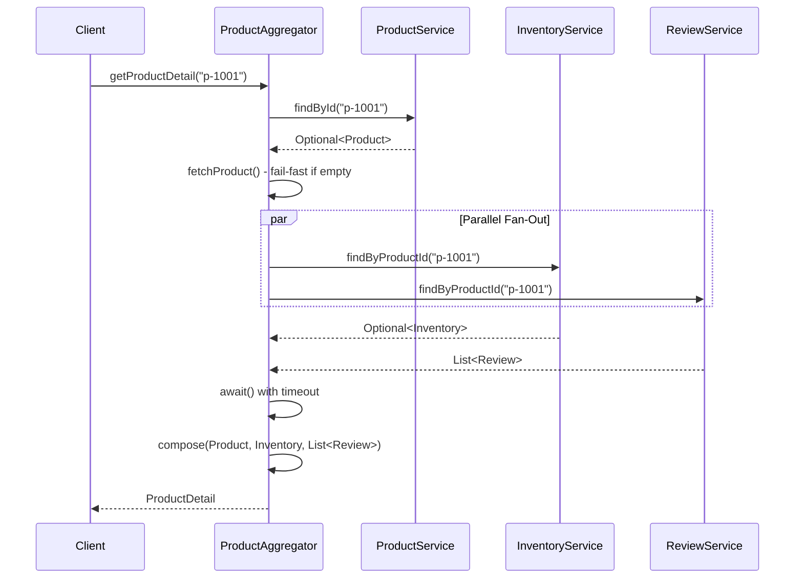
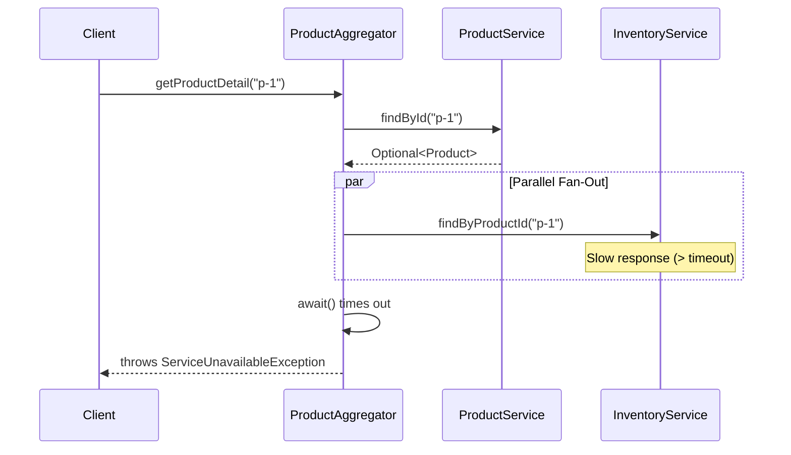

# Low-Level Design: Microservices Aggregator Pattern

## 1. Requirements & Scope

### Functional Requirements

1. **Single-Call Aggregation**: The client must be able to retrieve a complete product detail page (product info, inventory status, and customer reviews) with a single call to the aggregator service, instead of making N separate calls to N microservices.

2. **Parallel Fan-Out**: The aggregator must invoke the downstream microservices (Product, Inventory, Review) in parallel using `CompletableFuture` to minimize total latency, rather than sequentially.

3. **Graceful Degradation**: The aggregator must handle partial failures gracefully — if inventory data is missing, it defaults to out-of-stock; if reviews are missing, it returns an empty list with a zero average rating.

4. **Fail-Fast Product Validation**: If the requested product does not exist in the product service, the aggregator must fail fast with a `ProductNotFoundException` without calling the downstream services.

5. **Timeout Protection**: The aggregator must enforce a configurable timeout on all downstream calls. If a downstream service exceeds the timeout, the aggregator must throw a `ServiceUnavailableException` rather than hanging indefinitely.

### Non-Functional Requirements

- **Thread-Safety**: All shared state (microservice data stores, aggregator) must be thread-safe for concurrent access using `ConcurrentHashMap`, immutable records, and a shared `ExecutorService`.
- **Extensibility**: New microservices can be added to the aggregation without changing the client contract; new implementations of `ProductService`, `InventoryService`, and `ReviewService` can be swapped via Dependency Inversion.
- **Immutability**: All data objects (`Product`, `Inventory`, `Review`, `ProductDetail`) must be immutable Java records to guarantee thread-safety and predictability.
- **Testability**: Each component must be independently testable with JUnit 5 and AssertJ; concurrency tests must verify thread-safe behavior under load.

---

## 2. Gradle Build Configuration

```kotlin
import org.gradle.api.tasks.testing.logging.TestExceptionFormat

plugins {
    java
}

group = "com.javastarterkit.patterns"
version = "1.0.0-SNAPSHOT"

java {
    toolchain {
        languageVersion = JavaLanguageVersion.of(25)
    }
}

repositories {
    mavenCentral()
}

dependencies {
    // Testing dependencies
    testImplementation(platform("org.junit:junit-bom:5.11.4"))
    testImplementation("org.junit.jupiter:junit-jupiter")
    testImplementation("org.assertj:assertj-core:3.26.3")
    testImplementation("org.mockito:mockito-core:5.14.2")
    testImplementation("org.mockito:mockito-junit-jupiter:5.14.2")
}

tasks.test {
    useJUnitPlatform()
    testLogging {
        exceptionFormat = TestExceptionFormat.FULL
        showExceptions = true
        showCauses = true
        showStackTraces = true
        showStandardStreams = true
    }
}
```

---

## 3. LLD Diagrams

### Class Diagram

```mermaid
classDiagram
    class MicroservicesAggregatorApp {
        +{static} demonstrate()
        +{static} main(String[] args)
    }

    class Product {
        <<record>>
        -String id
        -String name
        -String description
        -String price
        +Product(String id, String name, String description, String price)
    }

    class Inventory {
        <<record>>
        -String productId
        -int quantity
        -boolean inStock
        +Inventory(String productId, int quantity, boolean inStock)
    }

    class Review {
        <<record>>
        -String author
        -int rating
        -String comment
        +Review(String author, int rating, String comment)
    }

    class ProductDetail {
        <<record>>
        -String id
        -String name
        -String description
        -String price
        -int stockQuantity
        -boolean inStock
        -int reviewCount
        -double averageRating
        -List~Review~ reviews
        +ProductDetail(...)
        +toString() String
    }

    class ProductService {
        <<interface>>
        +findById(String productId) Optional~Product~
    }

    class InventoryService {
        <<interface>>
        +findByProductId(String productId) Optional~Inventory~
    }

    class ReviewService {
        <<interface>>
        +findByProductId(String productId) List~Review~
    }

    class InMemoryProductService {
        -ConcurrentHashMap~String, Product~ products
        +findById(String productId) Optional~Product~
    }

    class InMemoryInventoryService {
        -ConcurrentHashMap~String, Inventory~ stock
        +findByProductId(String productId) Optional~Inventory~
    }

    class InMemoryReviewService {
        -ConcurrentHashMap~String, List~Review~~ reviews
        +findByProductId(String productId) List~Review~
    }

    class ProductAggregator {
        -ProductService productService
        -InventoryService inventoryService
        -ReviewService reviewService
        -ExecutorService executorService
        -long timeoutSeconds
        +ProductAggregator(ProductService, InventoryService, ReviewService)
        +ProductAggregator(ProductService, InventoryService, ReviewService, ExecutorService, long)
        +getProductDetail(String productId) ProductDetail
        +shutdown()
        -fetchProduct(String productId) Product
        -fetchInventory(String productId) Inventory
        -fetchReviews(String productId) List~Review~
        -await(CompletableFuture~T~, String) T
        -compose(Product, Inventory, List~Review~) ProductDetail
    }

    class AggregatorException {
        +AggregatorException(String message)
        +AggregatorException(String message, Throwable cause)
    }

    class ProductNotFoundException {
        +ProductNotFoundException(String message)
    }

    class ServiceUnavailableException {
        +ServiceUnavailableException(String message)
        +ServiceUnavailableException(String message, Throwable cause)
    }

    InMemoryProductService ..|> ProductService
    InMemoryInventoryService ..|> InventoryService
    InMemoryReviewService ..|> ReviewService
    ProductAggregator --> ProductService : depends on
    ProductAggregator --> InventoryService : depends on
    ProductAggregator --> ReviewService : depends on
    ProductAggregator --> ProductDetail : composes
    ProductDetail --> Review : contains
    ProductNotFoundException --|> AggregatorException
    ServiceUnavailableException --|> AggregatorException
    ProductAggregator ..|> ProductNotFoundException : throws
    ProductAggregator ..|> ServiceUnavailableException : throws
    MicroservicesAggregatorApp --> ProductAggregator : wires
    MicroservicesAggregatorApp --> InMemoryProductService : wires
    MicroservicesAggregatorApp --> InMemoryInventoryService : wires
    MicroservicesAggregatorApp --> InMemoryReviewService : wires
```

### Sequence Diagram — Get Product Detail (Primary Use Case)



### Sequence Diagram — Timeout / Service Unavailable



### Component Diagram

```mermaid
graph TD
    subgraph "Client"
        C[Client Application]
    end

    subgraph "Aggregator Layer"
        PA[ProductAggregator<br/>CompletableFuture fan-out]
    end

    subgraph "Microservices"
        PS[ProductService<br/>Interface]
        IS[InventoryService<br/>Interface]
        RS[ReviewService<br/>Interface]
        IPS[InMemoryProductService<br/>ConcurrentHashMap]
        IIS[InMemoryInventoryService<br/>ConcurrentHashMap]
        IRS[InMemoryReviewService<br/>ConcurrentHashMap]
    end

    subgraph "Domain Models"
        P[Product<br/>record]
        I[Inventory<br/>record]
        R[Review<br/>record]
        PD[ProductDetail<br/>record]
    end

    subgraph "Exception Hierarchy"
        AE[AggregatorException<br/>Base]
        PNF[ProductNotFoundException]
        SUE[ServiceUnavailableException]
    end

    C --> PA
    PA --> PS
    PA --> IS
    PA --> RS
    IPS ..|> PS
    IIS ..|> IS
    IRS ..|> RS
    PA --> PD : composes
    PD --> R : contains
    PA ..|> PNF : throws
    PA ..|> SUE : throws
    PNF --|> AE
    SUE --|> AE
```

---

## 4. System Implementation Details & Code

### Package Structure

```
com.javastarterkit.patterns.microservicesaggregator
├── MicroservicesAggregatorApp.java      # Main entry point (wires services)
├── aggregator/
│   └── ProductAggregator.java           # Core aggregator with parallel fan-out
├── models/                              # Immutable domain records
│   ├── Product.java                     # Product catalog data
│   ├── Inventory.java                   # Stock availability data
│   ├── Review.java                      # Customer review data
│   └── ProductDetail.java               # Unified composed response
├── services/                            # Microservice contracts (DIP)
│   ├── ProductService.java              # Product service interface
│   ├── InventoryService.java            # Inventory service interface
│   ├── ReviewService.java               # Review service interface
│   └── impl/                            # Concrete implementations
│       ├── InMemoryProductService.java  # ConcurrentHashMap-backed
│       ├── InMemoryInventoryService.java# ConcurrentHashMap-backed
│       └── InMemoryReviewService.java   # ConcurrentHashMap-backed
└── exception/                           # Exception hierarchy
    ├── AggregatorException.java         # Base runtime exception
    ├── ProductNotFoundException.java    # Product not found
    └── ServiceUnavailableException.java # Downstream timeout/failure
```

### Core Components

#### 1. Domain Models — `models`

- **Product**: Immutable record representing product catalog data (id, name, description, price). Validates all fields are non-null. Inherently thread-safe.
- **Inventory**: Immutable record representing stock availability (productId, quantity, inStock). Validates non-negative quantity. Inherently thread-safe.
- **Review**: Immutable record representing a customer review (author, rating 1-5, comment). Validates rating range. Inherently thread-safe.
- **ProductDetail**: Immutable record representing the unified composed response. Returns a defensive copy of the reviews list via `List.copyOf()`. Inherently thread-safe.

#### 2. Microservice Contracts — `services`

- **ProductService**: Interface defining `findById(String)`. The aggregator depends on this abstraction (Dependency Inversion Principle).
- **InventoryService**: Interface defining `findByProductId(String)`. The aggregator depends on this abstraction.
- **ReviewService**: Interface defining `findByProductId(String)`. The aggregator depends on this abstraction.

#### 3. Concrete Microservice Implementations — `services/impl`

- **InMemoryProductService**: Thread-safe implementation using `ConcurrentHashMap` for lock-free concurrent reads. Pre-populated with a default catalog.
- **InMemoryInventoryService**: Thread-safe implementation using `ConcurrentHashMap`. Pre-populated with default stock.
- **InMemoryReviewService**: Thread-safe implementation using `ConcurrentHashMap`. Returns immutable lists via `List.copyOf()`.

#### 4. Aggregator — `aggregator`

- **ProductAggregator**: The core aggregator service. Immutable after construction. Uses `CompletableFuture` to fan out to inventory and review services in parallel. Enforces a configurable timeout on all downstream calls. Composes the unified `ProductDetail` response.

#### 5. Exception Hierarchy — `exception`

- **AggregatorException**: Base runtime exception for all aggregator domain errors.
- **ProductNotFoundException**: Thrown when the product service returns no product for the requested ID.
- **ServiceUnavailableException**: Thrown when a downstream service times out or fails.

### Thread-Safety Strategy

1. **Immutable Value Objects**: `Product`, `Inventory`, `Review`, and `ProductDetail` are immutable Java records — inherently thread-safe.
2. **Thread-Safe Microservices**: All in-memory implementations use `ConcurrentHashMap` for lock-free concurrent reads and atomic writes.
3. **Immutable Aggregator**: `ProductAggregator` holds only final fields; it is safe to share across threads.
4. **Parallel Fan-Out**: Downstream calls are executed in parallel via a shared `ExecutorService` and `CompletableFuture`. Each call is isolated in its own future.
5. **Timeout Protection**: All downstream calls use `future.get(timeout, TimeUnit.SECONDS)` to prevent indefinite blocking.
6. **Defensive Copies**: `ProductDetail` and `InMemoryReviewService` return `List.copyOf()` to prevent external mutation.

### Code Examples

#### Core Aggregator (Parallel Fan-Out)

```java
public ProductDetail getProductDetail(String productId) {
    Objects.requireNonNull(productId, "Product ID must not be null");

    // Step 1: Fetch product (fail-fast if not found)
    Product product = fetchProduct(productId);

    // Step 2: Fan out to inventory and review services in parallel
    CompletableFuture<Inventory> inventoryFuture = CompletableFuture
            .supplyAsync(() -> fetchInventory(productId), executorService);
    CompletableFuture<List<Review>> reviewsFuture = CompletableFuture
            .supplyAsync(() -> fetchReviews(productId), executorService);

    // Step 3: Wait for both with timeout
    Inventory inventory = await(inventoryFuture, "InventoryService");
    List<Review> reviews = await(reviewsFuture, "ReviewService");

    // Step 4: Compose the unified response
    return compose(product, inventory, reviews);
}
```

#### Thread-Safe Microservice

```java
public final class InMemoryProductService implements ProductService {
    private final ConcurrentHashMap<String, Product> products = new ConcurrentHashMap<>();

    public InMemoryProductService() {
        products.put("p-1001", new Product("p-1001", "Laptop Pro", "High-performance laptop", "1299.99"));
        // ...
    }

    @Override
    public Optional<Product> findById(String productId) {
        Objects.requireNonNull(productId, "Product ID must not be null");
        return Optional.ofNullable(products.get(productId));
    }
}
```

#### Immutable Domain Record

```java
public record ProductDetail(
        String id,
        String name,
        String description,
        String price,
        int stockQuantity,
        boolean inStock,
        int reviewCount,
        double averageRating,
        List<Review> reviews) {

    public ProductDetail {
        Objects.requireNonNull(id, "Product ID must not be null");
        // ... validation
        reviews = List.copyOf(reviews);  // Defensive copy
    }
}
```

### End-to-End Execution Flow

The `MicroservicesAggregatorApp.demonstrate()` method wires the system:

1. **Microservices are created**: `InMemoryProductService`, `InMemoryInventoryService`, `InMemoryReviewService`.
2. **Aggregator is created**: `new ProductAggregator(productService, inventoryService, reviewService)`.
3. **Client calls aggregator** for product `p-1001`:
   - Aggregator fetches product (fail-fast if not found).
   - Aggregator fans out to inventory and review services in parallel.
   - Aggregator composes the unified `ProductDetail`.
4. **Client calls aggregator** for out-of-stock product `p-1002` — graceful degradation.
5. **Client calls aggregator** for no-review product `p-1003` — zero rating.
6. **Client calls aggregator** for unknown product `p-9999` — `ProductNotFoundException`.
7. **Aggregator is shut down** to release the executor.

### Test Coverage

The test suite (`MicroservicesAggregatorAppTest`) covers:

- **Model validation**: null field rejection, negative quantity rejection, invalid rating rejection, defensive copies.
- **Microservice behavior**: each service returns data independently.
- **Aggregator composition**: full composition, out-of-stock handling, no-review handling, missing inventory defaults.
- **Error handling**: `ProductNotFoundException`, `ServiceUnavailableException` on timeout, null product ID rejection.
- **Concurrency**: 100 concurrent requests, consistent results under 50-thread load.
- **End-to-end**: smoke test of the full demonstration.