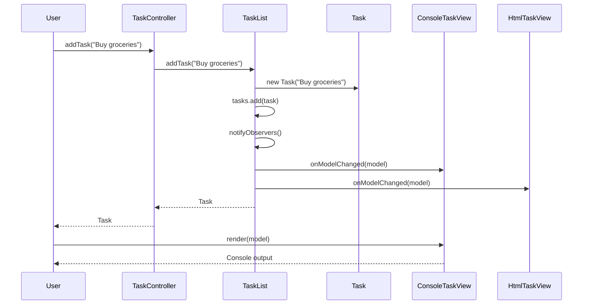
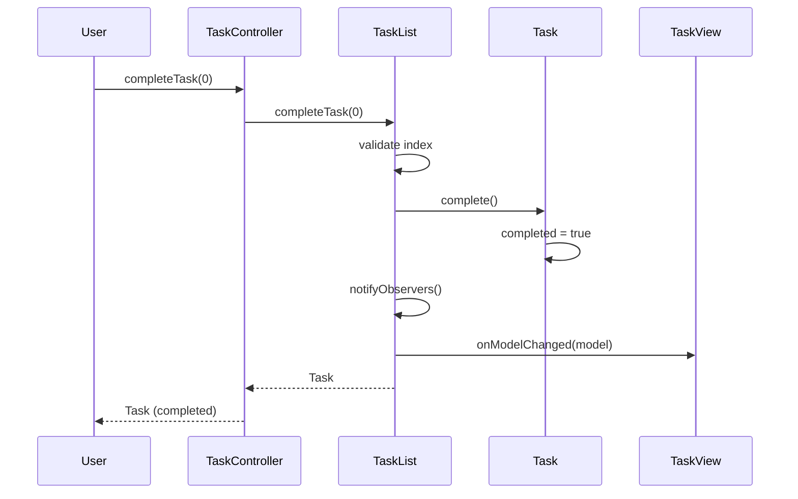

# Low-Level Design: Model-View-Controller (MVC) Pattern

## 1. Requirements & Scope

### Functional Requirements

1. **Separation of Concerns**: The application must be organized into three interconnected components — **Model** (data + business rules), **View** (rendering), and **Controller** (user input handling) — where each component has a single, well-defined responsibility.

2. **Task Management Use Cases**: The system must support adding tasks, completing tasks (by index or by ID), listing tasks, and tracking completion counts — all through the controller.

3. **Observer Notification**: The model must notify all registered views whenever its state changes (task added, task completed), allowing views to re-render automatically.

4. **Multiple Views**: The system must support multiple views (e.g., Console and HTML) observing the same model simultaneously, each rendering the data in its own format.

5. **Model Independence**: The model must have **no knowledge** of the views or controller — it only manages data and business rules, and notifies observers through a generic interface.

### Non-Functional Requirements

- **Thread-Safety**: All shared state (task list, observer list) must be thread-safe for concurrent access using `CopyOnWriteArrayList` and synchronized task state.
- **Extensibility**: New views can be added without modifying the model or controller; new task operations can be added without modifying views.
- **Immutability**: Task data (ID, description) must be immutable; the task list must return defensive copies via `List.copyOf()`.
- **Testability**: Each component must be independently testable with JUnit 5 and AssertJ; concurrency tests must verify thread-safe behavior under load.

---

## 2. Gradle Build Configuration

```kotlin
import org.gradle.api.tasks.testing.logging.TestExceptionFormat

plugins {
    java
}

group = "com.javastarterkit.patterns"
version = "1.0.0-SNAPSHOT"

java {
    toolchain {
        languageVersion = JavaLanguageVersion.of(25)
    }
}

repositories {
    mavenCentral()
}

dependencies {
    // Testing dependencies
    testImplementation(platform("org.junit:junit-bom:5.11.4"))
    testImplementation("org.junit.jupiter:junit-jupiter")
    testImplementation("org.assertj:assertj-core:3.26.3")
    testImplementation("org.mockito:mockito-core:5.14.2")
    testImplementation("org.mockito:mockito-junit-jupiter:5.14.2")
}

tasks.test {
    useJUnitPlatform()
    testLogging {
        exceptionFormat = TestExceptionFormat.FULL
        showExceptions = true
        showCauses = true
        showStackTraces = true
        showStandardStreams = true
    }
}
```

---

## 3. LLD Diagrams

### Class Diagram

```mermaid
classDiagram
    class ModelViewControllerApp {
        +{static} demonstrate()
        +{static} main(String[] args)
    }

    class Task {
        -String id
        -String description
        -boolean completed
        +Task(String description)
        +Task(String id, String description)
        +id() String
        +description() String
        +isCompleted() boolean
        +complete()
        +toString() String
    }

    class TaskList {
        -CopyOnWriteArrayList~Task~ tasks
        -CopyOnWriteArrayList~TaskView~ observers
        +addObserver(TaskView view)
        +removeObserver(TaskView view)
        +addTask(String description) Task
        +completeTask(int index) Task
        +completeTaskById(String taskId) Task
        +tasks() List~Task~
        +size() int
        +completedCount() int
        -notifyObservers()
    }

    class TaskView {
        <<interface>>
        +render(TaskList model)
        +onModelChanged(TaskList model)
    }

    class ConsoleTaskView {
        +render(TaskList model)
        +onModelChanged(TaskList model)
    }

    class HtmlTaskView {
        +render(TaskList model)
        +onModelChanged(TaskList model)
    }

    class TaskController {
        -TaskList model
        +TaskController(TaskList model)
        +addTask(String description) Task
        +completeTask(int index) Task
        +completeTaskById(String taskId) Task
        +listTasks() List~Task~
        +taskCount() int
        +completedCount() int
    }

    class MvcException {
        +MvcException(String message)
        +MvcException(String message, Throwable cause)
    }

    class TaskNotFoundException {
        +TaskNotFoundException(String message)
    }

    TaskList --> Task : contains
    TaskList --> TaskView : notifies
    ConsoleTaskView ..|> TaskView
    HtmlTaskView ..|> TaskView
    TaskController --> TaskList : depends on
    TaskNotFoundException --|> MvcException
    TaskList ..|> TaskNotFoundException : throws
    ModelViewControllerApp --> TaskList : wires
    ModelViewControllerApp --> TaskController : wires
    ModelViewControllerApp --> ConsoleTaskView : wires
    ModelViewControllerApp --> HtmlTaskView : wires
```

### Sequence Diagram — Add Task (Primary Use Case)



### Sequence Diagram — Complete Task



### Component Diagram

```mermaid
graph TD
    subgraph "Controller Layer"
        TC[TaskController<br/>User input handler]
    end

    subgraph "Model Layer"
        TL[TaskList<br/>CopyOnWriteArrayList]
        T[Task<br/>Entity - synchronized]
    end

    subgraph "View Layer"
        TV[TaskView<br/>Interface]
        CV[ConsoleTaskView<br/>Plain text]
        HV[HtmlTaskView<br/>HTML]
    end

    subgraph "Exception Hierarchy"
        ME[MvcException<br/>Base]
        TNF[TaskNotFoundException]
    end

    TC --> TL
    TL --> T : contains
    TL --> TV : notifies
    CV ..|> TV
    HV ..|> TV
    TL ..|> TNF : throws
    TNF --|> ME
```

---

## 4. System Implementation Details & Code

### Package Structure

```
com.javastarterkit.patterns.modelviewcontroller
├── ModelViewControllerApp.java      # Main entry point (wires MVC)
├── model/                           # Model layer
│   ├── Task.java                    # Task entity (synchronized state)
│   └── TaskList.java                # Task list model (observer pattern)
├── view/                            # View layer
│   ├── TaskView.java                # View contract (interface)
│   ├── ConsoleTaskView.java         # Console rendering
│   └── HtmlTaskView.java            # HTML rendering
├── controller/                      # Controller layer
│   └── TaskController.java          # User input handler
└── exception/                       # Exception hierarchy
    ├── MvcException.java            # Base runtime exception
    └── TaskNotFoundException.java   # Task not found
```

### Core Components

#### 1. Model Layer — `model`

- **Task**: Entity with immutable ID and description, and synchronized completion state. Validates non-null and non-blank descriptions. Thread-safe via `synchronized` on `isCompleted()` and `complete()`.
- **TaskList**: The core model. Uses `CopyOnWriteArrayList` for thread-safe task storage and observer registration. Notifies all registered views on every state change. Returns defensive copies via `List.copyOf()`.

#### 2. View Layer — `view`

- **TaskView**: Interface contract defining `render()` and `onModelChanged()`. Views have no knowledge of the controller or business logic.
- **ConsoleTaskView**: Renders tasks as plain text with completion indicators.
- **HtmlTaskView**: Renders tasks as HTML, demonstrating multiple views for the same model.

#### 3. Controller Layer — `controller`

- **TaskController**: Stateless controller that receives user commands, validates them, and delegates to the model. Thread-safe because it holds no mutable state.

#### 4. Exception Hierarchy — `exception`

- **MvcException**: Base runtime exception for all MVC domain errors.
- **TaskNotFoundException**: Thrown when a task cannot be found by index or ID.

### Thread-Safety Strategy

1. **CopyOnWriteArrayList**: Used for both the task list and observer list, providing thread-safe iteration and atomic writes.
2. **Synchronized Task State**: `Task.isCompleted()` and `Task.complete()` are synchronized to ensure atomic state transitions.
3. **Immutable Task Data**: Task ID and description are final fields — inherently thread-safe.
4. **Stateless Controller**: `TaskController` holds only a final reference to the model — safe to share across threads.
5. **Defensive Copies**: `TaskList.tasks()` returns `List.copyOf()` to prevent external mutation.

### Code Examples

#### Thread-Safe Model (TaskList)

```java
public final class TaskList {
    private final CopyOnWriteArrayList<Task> tasks = new CopyOnWriteArrayList<>();
    private final CopyOnWriteArrayList<TaskView> observers = new CopyOnWriteArrayList<>();

    public Task addTask(String description) {
        Objects.requireNonNull(description, "Task description must not be null");
        if (description.isBlank()) {
            throw new IllegalArgumentException("Task description must not be blank");
        }
        Task task = new Task(description);
        tasks.add(task);
        notifyObservers();
        return task;
    }

    public List<Task> tasks() {
        return List.copyOf(tasks);
    }

    private void notifyObservers() {
        for (TaskView view : observers) {
            view.onModelChanged(this);
        }
    }
}
```

#### Synchronized Task Entity

```java
public final class Task {
    private final String id;
    private final String description;
    private boolean completed;

    public synchronized boolean isCompleted() {
        return completed;
    }

    public synchronized void complete() {
        this.completed = true;
    }
}
```

#### View Contract

```java
public interface TaskView {
    void render(TaskList model);

    default void onModelChanged(TaskList model) {
        // Optional hook: re-render when the model changes.
    }
}
```

### End-to-End Execution Flow

The `ModelViewControllerApp.demonstrate()` method wires the MVC components:

1. **Model is created**: `new TaskList()`.
2. **Views are created**: `new ConsoleTaskView()` and `new HtmlTaskView()`.
3. **Controller is created**: `new TaskController(model)`.
4. **Views are attached**: `model.addObserver(consoleView)` and `model.addObserver(htmlView)`.
5. **User adds tasks** through the controller — the model notifies both views.
6. **User completes a task** through the controller — the model notifies both views.
7. **Both views render** the same model in their respective formats.

### Test Coverage

The test suite (`ModelViewControllerAppTest`) covers:

- **Model validation**: null/blank description rejection, unique ID generation, task completion.
- **Model behavior**: task addition, completion by index/ID, defensive copies, `TaskNotFoundException`.
- **Observer notification**: notification on add/complete, observer removal.
- **Controller behavior**: task addition, completion by index/ID, null model rejection.
- **Multiple views**: console and HTML views render the same model.
- **Concurrency**: 100 concurrent task additions, 50 concurrent observer notifications.
- **End-to-end**: smoke test of the full demonstration.