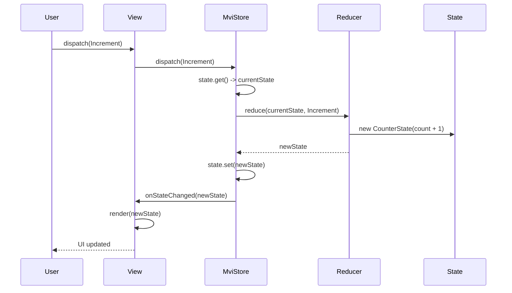

# Low-Level Design: Model-View-Intent (MVI) Pattern

## 1. Requirements & Scope

### Functional Requirements

1. **Unidirectional Data Flow**: The application must enforce a strict unidirectional data flow: View → Intent → Reducer → State → View. State changes are predictable and traceable.

2. **Immutable Intents**: Each user action must be expressed as an immutable message (Intent). Intents are the **only** way to change state. Sealed interfaces ensure exhaustive handling.

3. **Immutable State**: The UI state must be an immutable snapshot. The View always renders from this single source of truth. State transitions produce new state objects, never mutating the original.

4. **Pure Reducers**: Reducers must be pure functions that take the current state and an intent, and produce a new state. Reducers must not have side effects.

5. **Observer Notification**: The store must notify all registered view observers whenever the state changes, allowing views to re-render automatically.

### Non-Functional Requirements

- **Thread-Safety**: The store must be thread-safe using `AtomicReference` for lock-free state swaps and `CopyOnWriteArrayList` for observer management.
- **Extensibility**: New intents, states, reducers, and views can be added without modifying existing components.
- **Immutability**: All state and intent objects must be immutable Java records to guarantee thread-safety and predictability.
- **Testability**: Reducers are pure functions that are trivially testable; the store supports concurrency tests.

---

## 2. Gradle Build Configuration

```kotlin
import org.gradle.api.tasks.testing.logging.TestExceptionFormat

plugins {
    java
}

group = "com.javastarterkit.patterns"
version = "1.0.0-SNAPSHOT"

java {
    toolchain {
        languageVersion = JavaLanguageVersion.of(25)
    }
}

repositories {
    mavenCentral()
}

dependencies {
    testImplementation(platform("org.junit:junit-bom:5.11.4"))
    testImplementation("org.junit.jupiter:junit-jupiter")
    testImplementation("org.assertj:assertj-core:3.26.3")
    testImplementation("org.mockito:mockito-core:5.14.2")
    testImplementation("org.mockito:mockito-junit-jupiter:5.14.2")
}

tasks.test {
    useJUnitPlatform()
    testLogging {
        exceptionFormat = TestExceptionFormat.FULL
        showExceptions = true
        showCauses = true
        showStackTraces = true
        showStandardStreams = true
    }
}
```

---

## 3. LLD Diagrams

### Class Diagram

```mermaid
classDiagram
    class ModelViewIntentApp {
        +{static} demonstrate()
        +{static} main(String[] args)
    }

    class MviStore~S, I~ {
        -AtomicReference~S~ state
        -Reducer~S, I~ reducer
        -CopyOnWriteArrayList~ViewObserver~S~~ observers
        +MviStore(S initialState, Reducer~S, I~ reducer)
        +state() S
        +addObserver(ViewObserver~S~ observer)
        +removeObserver(ViewObserver~S~ observer)
        +dispatch(I intent)
    }

    class Reducer~S, I~ {
        <<interface>>
        +reduce(S state, I intent) S
    }

    class ViewObserver~S~ {
        <<interface>>
        +onStateChanged(S state)
    }

    class CounterIntent {
        <<sealed interface>>
    }
    class Increment
    class Decrement
    class Reset

    class TaskIntent {
        <<sealed interface>>
    }
    class AddTask {
        -String description
    }
    class CompleteTask {
        -int index
    }

    class CounterState {
        <<record>>
        -int count
        +copyWith(int count) CounterState
    }

    class TaskState {
        <<record>>
        -List~TaskItem~ tasks
        +copyWith(List~TaskItem~ tasks) TaskState
    }

    class TaskItem {
        <<record>>
        -String description
        -boolean completed
        +complete() TaskItem
    }

    class CounterReducer {
        +reduce(CounterState state, CounterIntent intent) CounterState
    }

    class TaskReducer {
        +reduce(TaskState state, TaskIntent intent) TaskState
    }

    class CounterView {
        +onStateChanged(CounterState state)
        +render(CounterState state)
    }

    class TaskListView {
        +onStateChanged(TaskState state)
        +render(TaskState state)
    }

    class MviException {
        +MviException(String message)
    }

    class InvalidIntentException {
        +InvalidIntentException(String message)
    }

    Increment ..|> CounterIntent
    Decrement ..|> CounterIntent
    Reset ..|> CounterIntent
    AddTask ..|> TaskIntent
    CompleteTask ..|> TaskIntent
    CounterReducer ..|> Reducer
    TaskReducer ..|> Reducer
    CounterView ..|> ViewObserver
    TaskListView ..|> ViewObserver
    MviStore --> Reducer : uses
    MviStore --> ViewObserver : notifies
    InvalidIntentException --|> MviException
    TaskReducer ..|> InvalidIntentException : throws
    ModelViewIntentApp --> MviStore : wires
    ModelViewIntentApp --> CounterReducer : wires
    ModelViewIntentApp --> TaskReducer : wires
```

### Sequence Diagram — Dispatch Intent (Primary Use Case)



### Component Diagram

```mermaid
graph TD
    subgraph "View Layer"
        CV[CounterView]
        TLV[TaskListView]
    end

    subgraph "Store Layer"
        MS[MviStore<br/>AtomicReference + CopyOnWriteArrayList]
    end

    subgraph "Reducer Layer"
        CR[CounterReducer<br/>Pure function]
        TR[TaskReducer<br/>Pure function]
    end

    subgraph "Intent Layer"
        CI[CounterIntent<br/>Sealed interface]
        TI[TaskIntent<br/>Sealed interface]
    end

    subgraph "State Layer"
        CS[CounterState<br/>Immutable record]
        TS[TaskState<br/>Immutable record]
    end

    subgraph "Exception Hierarchy"
        ME[MviException]
        IIE[InvalidIntentException]
    end

    CV --> MS
    TLV --> MS
    MS --> CR
    MS --> TR
    CR --> CI
    TR --> TI
    CR --> CS
    TR --> TS
    TR ..|> IIE : throws
    IIE --|> ME
```

---

## 4. System Implementation Details & Code

### Package Structure

```
com.javastarterkit.patterns.modelviewintent
├── ModelViewIntentApp.java          # Main entry point
├── core/                            # Core MVI infrastructure
│   ├── MviStore.java                # Thread-safe store (AtomicReference)
│   ├── Reducer.java                 # Pure reducer interface
│   └── ViewObserver.java            # Observer interface
├── intent/                          # Immutable user actions
│   ├── CounterIntent.java           # Sealed interface
│   ├── Increment.java
│   ├── Decrement.java
│   ├── Reset.java
│   ├── TaskIntent.java              # Sealed interface
│   ├── AddTask.java
│   └── CompleteTask.java
├── state/                           # Immutable state snapshots
│   ├── CounterState.java
│   ├── TaskState.java
│   └── TaskItem.java
├── reducer/                         # Pure reducer functions
│   ├── CounterReducer.java
│   └── TaskReducer.java
├── view/                            # View implementations
│   ├── CounterView.java
│   └── TaskListView.java
└── exception/                       # Exception hierarchy
    ├── MviException.java
    └── InvalidIntentException.java
```

### Thread-Safety Strategy

1. **AtomicReference**: The store uses `AtomicReference<S>` for lock-free, atomic state swaps.
2. **CopyOnWriteArrayList**: Observer registration and notification are thread-safe.
3. **Immutable Records**: All state and intent objects are immutable Java records.
4. **Pure Reducers**: Reducers have no side effects and are inherently thread-safe.
5. **Defensive Copies**: `TaskState` creates defensive copies via `List.copyOf()`.

### Code Examples

#### Thread-Safe Store

```java
public final class MviStore<S, I> {
    private final AtomicReference<S> state;
    private final Reducer<S, I> reducer;
    private final CopyOnWriteArrayList<ViewObserver<S>> observers = new CopyOnWriteArrayList<>();

    public void dispatch(I intent) {
        S currentState = state.get();
        S newState = reducer.reduce(currentState, intent);
        state.set(newState);
        notifyObservers(newState);
    }
}
```

#### Pure Reducer with Pattern Matching

```java
public CounterState reduce(CounterState state, CounterIntent intent) {
    return switch (intent) {
        case Increment ignored -> state.copyWith(state.count() + 1);
        case Decrement ignored -> state.copyWith(state.count() - 1);
        case Reset ignored -> state.copyWith(0);
    };
}
```

#### Sealed Intent Hierarchy

```java
public sealed interface CounterIntent permits Increment, Decrement, Reset {}

public record Increment() implements CounterIntent {}
public record Decrement() implements CounterIntent {}
public record Reset() implements CounterIntent {}
```

### Test Coverage

- **Intent validation**: null/blank rejection, negative index rejection.
- **State immutability**: copyWith creates new instances, defensive copies, immutable lists.
- **Reducer purity**: original state unchanged, new state produced.
- **Store dispatch**: state updates, observer notification, observer removal.
- **Error handling**: null rejection for state/reducer/intent, InvalidIntentException.
- **Concurrency**: 100 concurrent dispatches, 50 concurrent notifications.
- **End-to-end**: smoke test of the full demonstration.