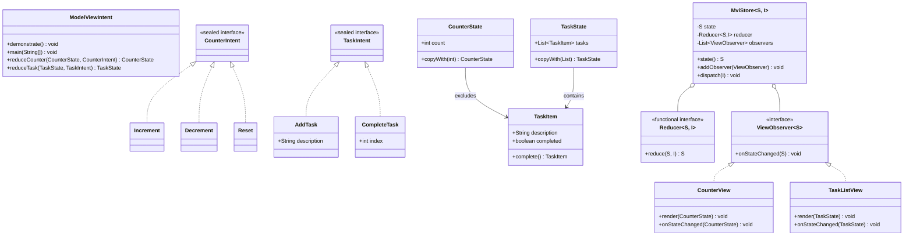
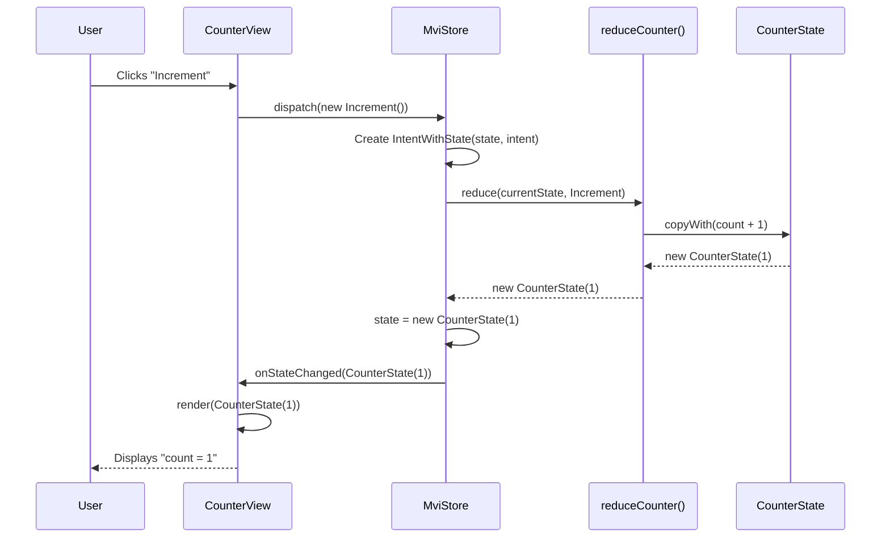
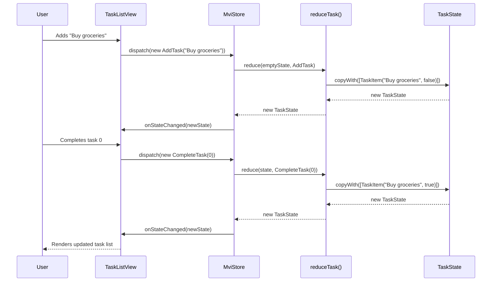
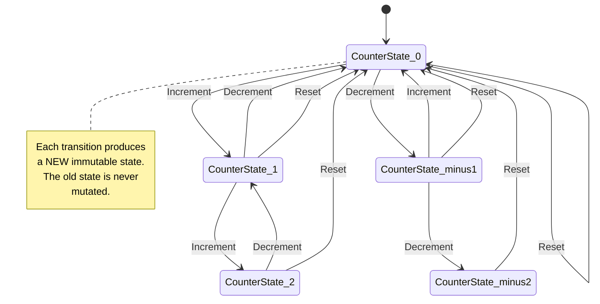
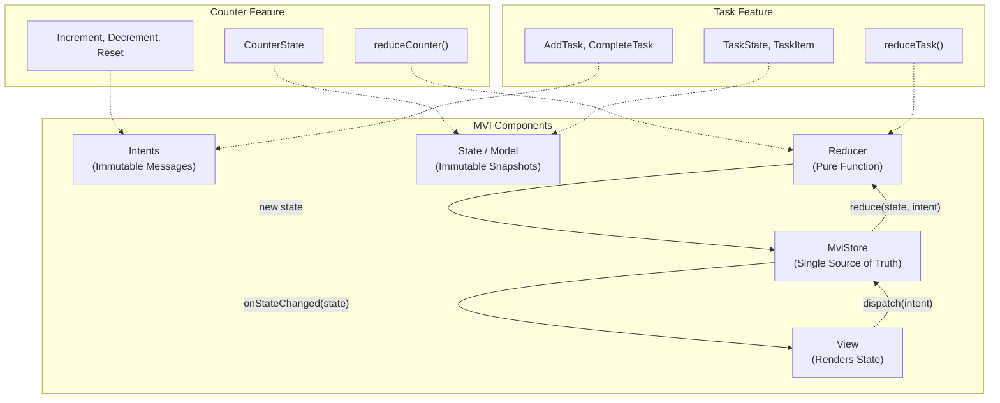

# Model-View-Intent (MVI) Pattern

## Overview

**Model-View-Intent (MVI)** is a **unidirectional data-flow** architecture built on three core concepts:

| Concept | Description |
|---------|-------------|
| **Intent** | A user's action expressed as an **immutable message** (e.g., `Increment`, `AddTask`). Intents are the *only* way to change state. |
| **Model (State)** | An **immutable snapshot** of the UI state. The View always renders from this single source of truth. |
| **View** | Renders the current state and dispatches intents. The View **never mutates state directly**. |

Between the View and the Model sits a **Reducer** — a pure function that takes the current state and an intent, and produces a **new** state. This guarantees:

- State changes are **predictable** and **traceable**
- State is **immutable** — no accidental mutation
- The data flow is strictly **one-directional**: `View → Intent → Reducer → State → View`

This example models a **counter** and a **task list** to demonstrate the full MVI flow.

---

## Low-Level Design (LLD)

### 1. Architecture Diagram (Unidirectional Data Flow)

```
┌─────────────────────────────────────────────────────────────────────┐
│                        MVI Architecture                             │
│                                                                     │
│    ┌──────────┐     Intent      ┌───────────┐     New State         │
│    │          │ ──────────────> │           │ ──────────────────┐   │
│    │   View   │                 │  Reducer  │                    │   │
│    │          │ <────────────── │  (pure)   │                    │   │
│    └──────────┘    Render       └───────────┘                    │   │
│         ▲                            ▲                           │   │
│         │                            │                           ▼   │
│         │                            │                     ┌─────────┐ │
│         │                            └─────────────────────│  Store  │ │
│         │                                                  │ (state) │ │
│         └──────────────────────────────────────────────────└─────────┘ │
│                  onStateChanged(state)                                 │
└─────────────────────────────────────────────────────────────────────┘
```

### 2. Class Diagram



### 3. Sequence Diagram — Counter Increment Flow



### 4. Sequence Diagram — Task Add + Complete Flow



### 5. State Diagram — Counter State Transitions



### 6. Component Diagram



### 7. Data Flow Diagram

```
┌──────────┐         ┌──────────┐         ┌──────────┐         ┌──────────┐
│          │  Intent  │          │  State  │          │  State  │          │
│   View   │────────> │  Store   │───────> │ Reducer  │───────> │   View   │
│          │          │          │  +Intent│ (pure)   │         │ (render) │
└──────────┘          └──────────┘         └──────────┘         └──────────┘
     ▲                                                                   │
     │                    onStateChanged(newState)                       │
     └───────────────────────────────────────────────────────────────────┘

Data Flow: View → Intent → Store → Reducer → New State → View (re-render)
```

---

## Structure

```
model-view-intent/
├── build.gradle.kts
├── README.md
└── src/
    ├── main/java/com/javastarterkit/patterns/modelviewintent/
    │   └── ModelViewIntent.java
    └── test/java/com/javastarterkit/patterns/modelviewintent/
        └── ModelViewIntentTest.java
```

## Implementation

The example is a single self-contained Java file with inner static classes/interfaces organized into five MVI components:

### Intents (Immutable User Actions)
| Intent | Description |
|--------|-------------|
| `CounterIntent` | Sealed interface for counter actions |
| `Increment` | Increment the counter by 1 |
| `Decrement` | Decrement the counter by 1 |
| `Reset` | Reset the counter to 0 |
| `TaskIntent` | Sealed interface for task actions |
| `AddTask` | Add a new task with a description |
| `CompleteTask` | Mark a task at index as complete |

### State (Immutable Model)
| Component | Description |
|-----------|-------------|
| `CounterState` | Immutable record holding `count`; provides `copyWith()` |
| `TaskState` | Immutable record holding a list of `TaskItem`s; provides `copyWith()` |
| `TaskItem` | Immutable record: description + completed flag; provides `complete()` |

### Reducers (Pure Functions)
| Reducer | Description |
|---------|-------------|
| `reduceCounter()` | Maps `(CounterState, CounterIntent)` → new `CounterState` |
| `reduceTask()` | Maps `(TaskState, TaskIntent)` → new `TaskState` |

### Store (Single Source of Truth)
| Component | Description |
|-----------|-------------|
| `MviStore<S, I>` | Generic store: holds state, reduces intents, notifies observers |
| `Reducer<S, I>` | Functional interface for pure reducers |
| `ViewObserver<S>` | Observer notified on state change |
| `IntentWithState<S, I>` | Carrier record for state + intent passed to reducer |

### Views (Render State, Dispatch Intents)
| View | Description |
|------|-------------|
| `CounterView` | Renders counter state as text; implements `ViewObserver` |
| `TaskListView` | Renders task list with progress; implements `ViewObserver` |

### Flow
1. The **View** renders the current **State**.
2. The user performs an action → the View dispatches an **Intent** to the **Store**.
3. The **Store** calls the **Reducer** with `(currentState, intent)`.
4. The **Reducer** (pure function) returns a **new immutable State**.
5. The **Store** updates its state and notifies all **View observers**.
6. The **View** re-renders from the new state.

## Usage

```bash
# Build the pattern
./gradlew :system-design-pattern:architectural:model-view-intent:build

# Run the tests
./gradlew :system-design-pattern:architectural:model-view-intent:test
```

## Sample Output

```
=== Model-View-Intent (MVI) Pattern ===
Unidirectional data flow: View -> Intent -> Reducer -> State -> View

--- Counter: initial state ---
  Counter view: count = 0

--- User dispatches Increment ---
  Counter view: count = 1

--- User dispatches Increment x2 ---
  Counter view: count = 3

--- User dispatches Decrement ---
  Counter view: count = 2

--- User dispatches Reset ---
  Counter view: count = 0

--- Task list: add and complete tasks ---
  Task view (1/2):
    0. [x] Buy groceries
    1. [ ] Write report

Benefits:
- Unidirectional data flow makes state changes predictable
- State is immutable (no accidental mutation)
- Reducers are pure functions (easy to test)
- Single source of truth for the View
```

## Benefits

- **Unidirectional data flow** — state changes follow a single, predictable path: `View → Intent → Reducer → State → View`.
- **Immutability** — state is never mutated; each intent produces a new state, eliminating race conditions and accidental side effects.
- **Pure reducers** — reducers are pure functions `(state, intent) → state`, making them trivial to unit test.
- **Single source of truth** — the `MviStore` is the only place state lives; the View always renders from it.
- **Traceability** — every state change can be traced to a specific intent, enabling time-travel debugging.
- **Sealed intents** — Java's sealed interfaces ensure all possible intents are known at compile time.

## Trade-offs

- **Boilerplate** — every user action requires a new intent class, which can feel verbose for simple UIs.
- **Learning curve** — developers familiar with MVC/MVP may need time to internalize the unidirectional flow.
- **Performance** — creating new immutable state on every change can be expensive for large state trees (mitigated with structural sharing).
- **Overkill for simple UIs** — MVI shines in complex, state-heavy applications but may be excessive for trivial screens.

## Comparison with MVC / MVP / MVVM

| Aspect | MVC | MVP | MVVM | **MVI** |
|--------|-----|-----|------|---------|
| Data flow | Bidirectional | Bidirectional | Bidirectional | **Unidirectional** |
| State | Mutable | Mutable | Mutable | **Immutable** |
| Source of truth | Model | Presenter | ViewModel | **Store** |
| Testing | Moderate | Good | Good | **Excellent** (pure reducers) |
| Traceability | Low | Low | Moderate | **High** (intent → state) |

## Category

Architectural

## Java Version

Java 25