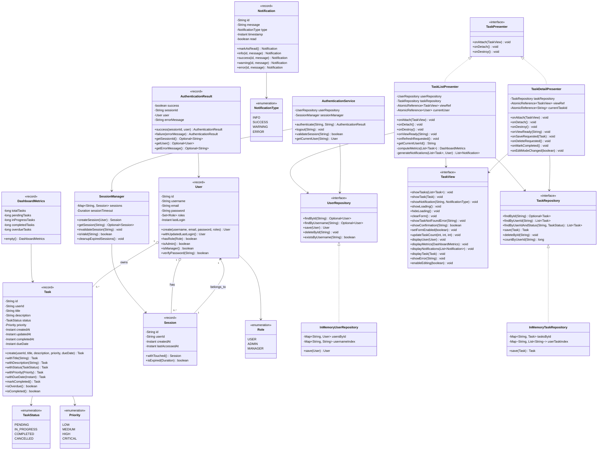
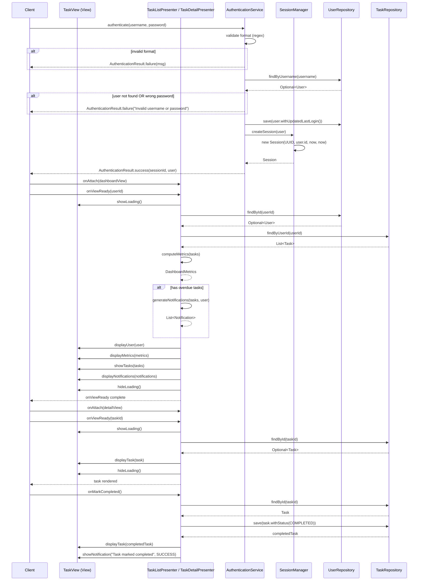
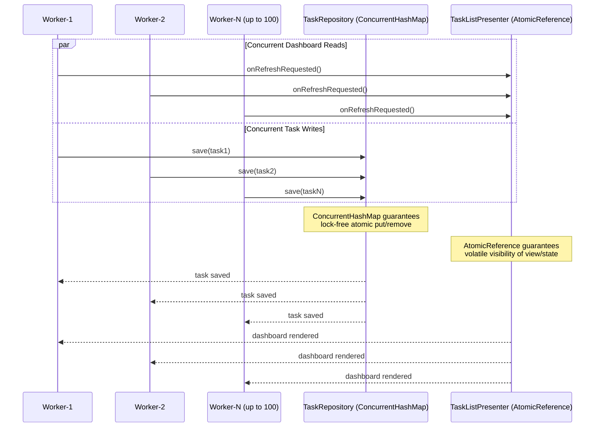

# Low-Level Design: Model-View-Presenter (MVP) Pattern

**Category**: Architectural  
**Difficulty**: Advanced  
**Target**: Java 25 (Amazon Corretto) · Gradle 9.6.1 · JUnit 5

---

## 1. Requirements & Scope

### Functional Requirements

1. **User Authentication & Session Management** — Users authenticate with username/password, receive a session token, and maintain state across interactions. Sessions expire after a configurable timeout.
2. **Dashboard Data Presentation** — Display user-specific dashboard with task metrics (total, pending, in-progress, completed, overdue), user profile, and generated notifications.
3. **Task Management CRUD Operations** — Create, read, update, and delete tasks with immutable state transitions (`with*()` methods), preserving ownership and audit timestamps.
4. **Presenter-Mediated View Updates** — The passive View renders exactly what the Presenter supplies; no business logic in the View. Presenters attach/detach cleanly for lifecycle management.
5. **Input Validation & Error Handling** — Comprehensive validation at service boundaries (username format, password strength) with typed exceptions (`TaskNotFoundException`, `IllegalStateException`) and user-friendly error messages.

### Non-Functional Requirements

- **Thread-Safety** — All repositories (`ConcurrentHashMap`), presenter mutable state (`AtomicReference`), and session management must be safe for concurrent UI interactions.
- **Extensibility** — New Views and Presenters can be added without modifying existing components (Open/Closed Principle); sealed contracts via interfaces.
- **Testability** — Full separation of Model, View, and Presenter enables unit testing with recording stubs and concurrency stress tests without UI frameworks.
- **Immutability** — All domain objects are Java records; state changes produce new instances via `with*()` methods.

---

## 2. Gradle Project Build Configuration

[See `build.gradle.kts` in this directory]

```kotlin
plugins {
    java
    application
}

group = "com.javastarterkit.patterns"
version = "1.0.0-SNAPSHOT"

java {
    toolchain {
        languageVersion = JavaLanguageVersion.of(25)
        vendor = JvmVendorSpec.AMAZON
    }
    withSourcesJar()
    withJavadocJar()
}

application {
    mainClass = "com.javastarterkit.patterns.modelviewpresenter.ModelViewPresenter"
}

repositories {
    mavenCentral()
}

dependencies {
    // Testing
    testImplementation(platform("org.junit:junit-bom:5.11.4"))
    testImplementation("org.junit.jupiter:junit-jupiter")
    testImplementation("org.junit.jupiter:junit-jupiter-params")
    testImplementation("org.assertj:assertj-core:3.27.3")
    testImplementation("org.mockito:mockito-junit-jupiter:5.14.2")
    testImplementation("org.awaitility:awaitility:4.3.0")

    // Concurrency utilities
    implementation("com.google.guava:guava:33.4.0-jre")

    // Logging
    implementation("org.slf4j:slf4j-api:2.0.16")
    implementation("ch.qos.logback:logback-classic:1.5.16")
}
```

---

## 3. LLD Diagrams (Mermaid.js)

### 3.1 Class Diagram — Core Entities & Relationships



### 3.2 Sequence Diagram — User Authentication → Dashboard → Task Detail End-to-End Flow



### 3.3 Sequence Diagram — Concurrent Access Safety



---

## 4. System Implementation Details & Code

### 4.1 Package Structure

```
com.javastarterkit.patterns.modelviewpresenter
├── ModelViewPresenter.java              # Demo application & composition root
├── exception/
│   ├── MvpException.java                # Base runtime exception
│   └── TaskNotFoundException.java       # Task lookup failure
├── model/                               # Immutable domain records & enums
│   ├── AuthenticationResult.java
│   ├── DashboardMetrics.java
│   ├── Notification.java
│   ├── NotificationType.java
│   ├── Priority.java
│   ├── Role.java
│   ├── Session.java
│   ├── Task.java
│   ├── TaskStatus.java
│   └── User.java
├── presenter/
│   ├── TaskDetailPresenter.java         # Single-task CRUD orchestration
│   ├── TaskListPresenter.java           # Dashboard orchestration
│   └── TaskPresenter.java               # Lifecycle contract interface
├── repository/
│   ├── InMemoryTaskRepository.java      # ConcurrentHashMap task store
│   ├── InMemoryUserRepository.java      # ConcurrentHashMap + username index
│   ├── TaskRepository.java              # Task persistence contract
│   └── UserRepository.java              # User persistence contract
├── service/
│   ├── AuthenticationService.java       # Login/logout/session validation
│   └── SessionManager.java              # Session lifecycle & expiry
└── view/
    └── TaskView.java                    # Passive view contract
```

### 4.2 Thread-Safety Strategy

| Component | Strategy | Why |
|-----------|----------|-----|
| **Domain Models** | Immutable Java records | No shared mutable state; thread-safe by design |
| **Repositories** | `ConcurrentHashMap` for key-value stores; synchronized `save()` for user uniqueness | Lock-free concurrent reads; atomic writes |
| **Presenters** | `AtomicReference<TaskView>` and `AtomicReference<User>`/`AtomicReference<String>` | Volatile visibility of attached view and current selection; lock-free state swaps |
| **Session Manager** | `ConcurrentHashMap<String, Session>` + immutable `Session` record | Concurrent session creation/invalidation |
| **Notifications** | `List.copyOf()` defensive copies | Prevents external mutation of returned collections |

**Key Java 25 / modern constructs used:**
- Records for all value/DTO types
- `AtomicReference` for lock-free state management
- `ConcurrentHashMap.computeIfAbsent()` for atomic index updates
- `List.copyOf()` / `.toList()` for immutable collection returns
- Pattern-matching-friendly `Optional` for null-safety
- `CountDownLatch` + `ExecutorService` for concurrency stress tests

### 4.3 SOLID Principles Applied

- **S** — Each class has one responsibility: `TaskListPresenter` only orchestrates dashboard; `TaskDetailPresenter` only handles task details; `SessionManager` only manages session lifecycles.
- **O** — Open for extension: new presenters implement `TaskPresenter` interface without modifying existing code; new repositories implement repository interfaces.
- **L** — Liskov substitutable: `InMemoryTaskRepository` and any future impl are substitutable for `TaskRepository`.
- **I** — Interface segregation: `TaskView` is a focused view contract; `TaskPresenter` is a slim lifecycle contract; repository interfaces are minimal.
- **D** — Dependency inversion: presenters depend on `UserRepository`/`TaskRepository` abstractions, not concrete in-memory implementations.

### 4.4 Key Code Examples

#### Record Models with Immutable State Transitions

```java
public record Task(
        String id,
        String userId,
        String title,
        String description,
        TaskStatus status,
        Priority priority,
        Instant createdAt,
        Instant updatedAt,
        Instant completedAt,
        Instant dueDate
) {
    public Task withStatus(TaskStatus newStatus) {
        Instant newCompletedAt = (newStatus == TaskStatus.COMPLETED) ? Instant.now() : null;
        return new Task(id, userId, title, description, newStatus, priority,
                createdAt, Instant.now(), newCompletedAt, dueDate);
    }

    public boolean isOverdue() {
        return dueDate != null && dueDate.isBefore(Instant.now())
                && status != TaskStatus.COMPLETED;
    }
}
```

#### Thread-Safe Presenter with AtomicReference

```java
public final class TaskListPresenter implements TaskPresenter {
    private final AtomicReference<TaskView> viewRef = new AtomicReference<>();
    private final AtomicReference<User> currentUser = new AtomicReference<>();

    @Override
    public void onAttach(TaskView view) {
        viewRef.set(Objects.requireNonNull(view, "View must not be null"));
    }

    public void onViewReady(String userId) {
        TaskView view = getAttachedView();
        view.showLoading();
        try {
            User user = userRepository.findById(userId)
                    .orElseThrow(() -> new TaskNotFoundException("User not found: " + userId));
            List<Task> tasks = taskRepository.findByUserId(userId);
            currentUser.set(user);
            view.displayUser(user);
            view.displayMetrics(computeMetrics(tasks));
            view.showTasks(tasks);
        } finally {
            view.hideLoading();
        }
    }
}
```

#### Thread-Safe Repository with ConcurrentHashMap

```java
public final class InMemoryTaskRepository implements TaskRepository {
    private final Map<String, Task> tasksById = new ConcurrentHashMap<>();
    private final Map<String, List<String>> userTaskIndex = new ConcurrentHashMap<>();

    @Override
    public Task save(Task task) {
        tasksById.put(task.id(), task);
        userTaskIndex.computeIfAbsent(task.userId(), k -> new ArrayList<>())
                .add(task.id());
        return task;
    }
}
```

### 4.5 Test Coverage

The test suite (`ModelViewPresenterTest`) covers:
- **Authentication**: valid/invalid credentials, username format validation, logout, null-safety
- **Dashboard Presentation**: metrics computation (5 scenarios), user display, notification generation
- **Task Operations**: load, save (preserving ownership), delete, mark-completed, not-found errors
- **Concurrency**: 100 concurrent task saves, 50 concurrent read/write operations on same task
- **End-to-End**: full authenticate → dashboard → detail → logout flow; `ModelViewPresenter.demonstrate()` runs without throwing

### 4.6 Running the Demo

```bash
# Build & run all tests
./gradlew :design-patterns:system-design-pattern:architectural:model-view-presenter:build

# Run the demo application
./gradlew :design-patterns:system-design-pattern:architectural:model-view-presenter:run